////
NO CAMBIAR!!
Codificación, idioma, tabla de contenidos, tipo de documento
////
:encoding: utf-8
:lang: es
:toc: right
:toc-title: Tabla de contenidos
:doctype: book
:linkattrs:
:icons: font
:source-highlighter: highlightjs

////
Nombre y título del trabajo
////
# Desarrollo de una API REST con Slim Framework y MySQL
Bases de datos. Grado en Ingeniería Informática. Manuel Torres <mtorres@ual.es>


// NO CAMBIAR!! (Entrar en modo no numerado de apartados)
:numbered!: 

[abstract]
== Resumen
////
COLOCA A CONTINUACION EL RESUMEN
////
En este tutorial se muestra cómo desarrollar una API REST básica para realizar operaciones CRUD (Crear, Leer, Actualizar y Eliminar) sobre una base de datos MySQL con Slim Framework utilizando XAMPP como entorno de desarrollo. Con fines didácticos, primero se creará una API REST sencilla con Slim Framework pero sin usar una base de datos. Posteriormente, se configurará una base de datos MySQL y se adaptará la API para permitir la interacción con la base de datos. También se explica cómo instalar XAMPP en Windows y cómo configurar Apache para interpretar las rutas de Slim. Además, se realiza una introducción básica a PHP mediante ejemplos de operaciones básicas, control de flujo, funciones, funciones de devolución de llamada, uso de arrays, etc. Asimismo, se muestran herramientas para pruebas de APIs, como Postman, y cómo configurar el entorno.

////
COLOCA A CONTINUACION LOS OBJETIVOS
////
.Objetivos

* Conocer los conceptos básicos de PHP y cómo desarrollar aplicaciones web en PHP.
* Aprender a instalar XAMPP en Windows y configurar Apache para interpretar las rutas de Slim.
* Desarrollar una API REST básica con Slim Framework y realizar operaciones CRUD sobre una base de datos MySQL.
* Conocer herramientas para pruebas de APIs, como Postman, y cómo configurar el entorno de desarrollo.

[TIP]
====
Disponible el https://github.com/ualmtorres/sample-rest-api[repositorio, window=_blank] usado en este tutorial.
====

// Entrar en modo numerado de apartados
:numbered:

## Introducción

PHP (acrónimo recursivo de "PHP: Hypertext Preprocessor") es un lenguaje de programación de código abierto muy popular especialmente adecuado para el desarrollo web. Es un lenguaje de programación de propósito general que se adapta especialmente al desarrollo web y puede ser incrustado en HTML. PHP es un lenguaje de programación del lado del servidor, lo que significa que el código se ejecuta en el servidor y no en el navegador del usuario, como ocurre con JavaScript. Además, es interpretado y no compilado, lo que significa que el código se ejecuta línea por línea.

Por otro lado, XAMPP es un paquete de software libre que facilita la instalación de un servidor web Apache, el lenguaje de programación PHP y una base de datos MySQL en sistemas operativos Windows, Linux y macOS. XAMPP es una solución todo en uno que permite a los desarrolladores crear aplicaciones web locales y probarlas antes de subirlas a un servidor remoto. Las siglas XAMPP significan: (X) de cualquier sistema operativo, Apache, MySQL, PHP y PHPMyAdmin, este último es una herramienta de administración de bases de datos MySQL desarrollada en PHP y que se ejecuta en un servidor web.

## Configuración del entorno de desarrollo

Para poder desarrollar aplicaciones web en PHP que interactúen con MySQL, es necesario contar con un entorno de desarrollo que incluya un servidor web, un intérprete de PHP y una base de datos MySQL. XAMPP es una solución todo en uno que incluye Apache, PHP y MySQL, por lo que es una opción muy adecuada para desarrollar aplicaciones web en PHP. En este tutorial se explicará cómo instalar XAMPP en Windows y cómo configurar el entorno de desarrollo para poder desarrollar aplicaciones web en PHP.

### Instalación de XAMPP

Para instalar XAMPP, se debe descargar el instalador desde la página web oficial https://www.apachefriends.org/es/index.html[XAMPP, window=_blank]. Se elegirá la versión para el sistema operativo en el que se vaya a realizar la instalación y basta con seguir las instrucciones de instalación. Por ejemplo, para la instalación en Windows, se puede descargar la última versión del https://sourceforge.net/projects/xampp/files/XAMPP%20Windows/8.2.12/xampp-windows-x64-8.2.12-0-VS16-installer.exe/download[instalador, window=_blank] y ejecutarlo. Durante la instalación, se pueden seleccionar los componentes que se desean instalar, como Apache, MySQL, PHP y PHPMyAdmin. En nuestro caso, necesitaremos instalar Apache, MySQL, PHP y PHPMyAdmin. 

[WARNING]
====
Se deberá tener cuidado con las opciones de instalación, ya que se instalarán servicios que pueden entrar en conflicto con otros servicios que ya que estén en ejecución. Además, se debe evitar instalar en la carpeta `C:\Program Files` para evitar problemas de permisos. Se recomienda instalar en `C:\xampp`.
====

Tras la instalación, se deberá ejecutar el panel de control de XAMPP y activar los servicios de Apache y MySQL. Para ello, se deberá abrir el panel de control de XAMPP y hacer clic en los botones `Start` de Apache y MySQL. Si los servicios se han iniciado correctamente, se mostrará un mensaje indicando que los servicios se han iniciado correctamente.

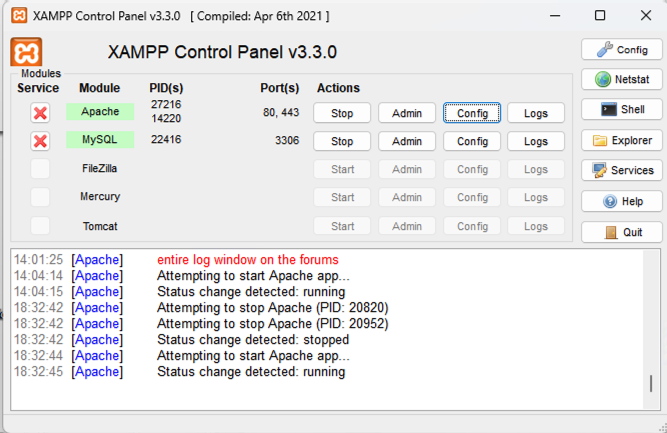

.Posibles problemas tras la instalación
****
Tras la instalación de XAMPP, es posible que se produzcan algunos problemas que impidan el correcto funcionamiento del servidor web. Uno de los problemas más comunes está relacionado con que Apache no puede iniciarse porque los puertos 80 y/o 443 están ocupados. 

Para solucionar este problema, se puede cambiar el puerto de escucha de Apache. Para ello, se debe abrir el archivo `httpd.conf` que se encuentra en la carpeta `C:\xampp\apache\conf` (o pulsar el botón `Config` de Apache en el panel de control de XAMPP) y buscar las líneas que contienen `Listen 80` y `Listen 443`. Se deben cambiar estos valores por otros puertos libres, por ejemplo, `Listen 8080` y `Listen 4433`. Tras realizar estos cambios, se debe reiniciar el servicio de Apache.

Otra opción es detener el servicio que está ocupando los puertos 80 y 443. Desde el panel de control de XAMPP es posible ejecutar `netstat` para ver qué servicios están ocupando estos puertos. Para detenerlos,  abrir una terminal con permisos de administrador y ejecutar `net stop HTTP`.

XAMPP ofrece una página de respuestas a preguntas frecuentes donde se puede encontrar información útil sobre problemas comunes y cómo solucionarlos: https://www.apachefriends.org/es/faq_windows.html[FAQ de XAMPP, , window=_blank].
****

#### Configuración de Apache

Apache es un servidor web de código abierto que es ampliamente utilizado. Es un servidor web multiplataforma que soporta PHP y Perl y otros lenguajes de programación. Es muy flexible y configurable, y permite a los desarrolladores personalizar la configuración del servidor web a sus necesidades.

La configuración de Apache en XAMPP se realiza pulsando el botón `Config` del panel de control de XAMPP y seleccionando la opción `Apache (httpd.conf)`. Se abrirá el archivo de configuración de Apache en un editor de texto. En este archivo se pueden configurar diferentes aspectos del servidor web, como los puertos en los que escucha el servidor, los directorios de documentos, los módulos que se cargan, etc.

[NOTE]
====
Si el equipo en el que se está ejecutando XAMPP tiene el puerto 80 ocupado por otro servicio, se puede cambiar el puerto en el que escucha Apache. Para ello, se deberá modificar la directiva `Listen` en el archivo de configuración de Apache. Por ejemplo, si se desea cambiar el puerto a 8080, se deberá modificar la directiva `Listen 80` por `Listen 8080`. Tras realizar el cambio, se deberá reiniciar el servicio de Apache para que los cambios surtan efecto.
====

#### Comprobación de la instalación

Si la instalación de XAMPP se ha llevado a cabo de forma satisfactoria, el panel de control de XAMPP deberá mostrar los servicios de Apache y MySQL en verde, lo que indica que los servicios se han iniciado correctamente. Para comprobar que el servidor web está funcionando correctamente, se puede abrir un navegador web y acceder a la dirección `http://localhost`. Si se muestra la página de inicio de XAMPP, significa que el servidor web está funcionando correctamente.

[NOTE]
====
Si se ha realizado un cambio de puerto en la configuración de Apache (p.e. `Listen 8080`), se deberá acceder a la dirección `http://localhost:8080` en lugar de `http://localhost`, donde `8080` es el puerto en el que escucha Apache.
====

La imagen siguiente muestra la página de inicio de XAMPP, que indica que el servidor web está funcionando correctamente.

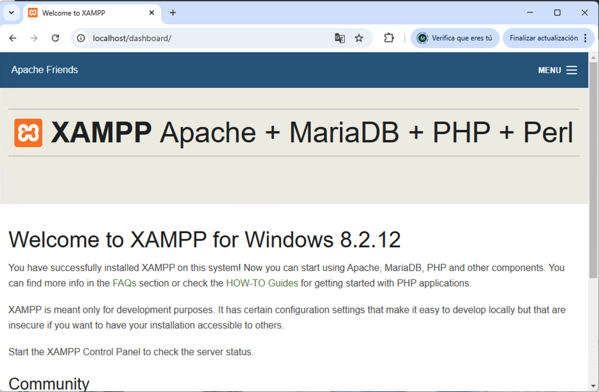

#### Comprendiendo el funcionamiento de la plaforma y la carpeta de publicación

XAMPP es una plataforma que incluye Apache como servidor web. Este servidor web se encarga de recibir las peticiones HTTP de los clientes (p.e. navegadores web) y devolver las respuestas adecuadas. Apache utiliza el protocolo HTTP para comunicarse con los clientes y el protocolo TCP/IP para comunicarse con el servidor. Como nuestro servidor web es local, se utiliza la dirección `http://localhost` para acceder al servidor web. Así, introduciremos esta dirección en el navegador web para acceder a nuestro servidor web local.

De forma nativa, Apache puede servidor contenido estático, como archivos HTML, CSS, imágenes, etc. Sin embargo, también puede servir contenido dinámico, como páginas PHP, a través de módulos que se cargan en el servidor. Con contenido dinámico se hace referencia a contenido que se genera en tiempo de ejecución, en lugar de estar almacenado en un archivo estático. Por ejemplo, una página PHP puede mostrar la fecha y hora actuales, el contenido de una base de datos, etc, sin necesidad de que el contenido que se presente esté almacenado en un archivo estático. La figura siguiente ilustra el código PHP para mostrar la hora actual, el código HTML generado (que se puede ver en las opciones para desarrolladores del navegador) y el resultado tal y como se visualiza en el navegador. Obsérvese como se genera de forma dinámica el contenido de la página. Esta tarea es realizada en el servidor combinando el contenido HTML e interpretando el código PHP línea a línea.

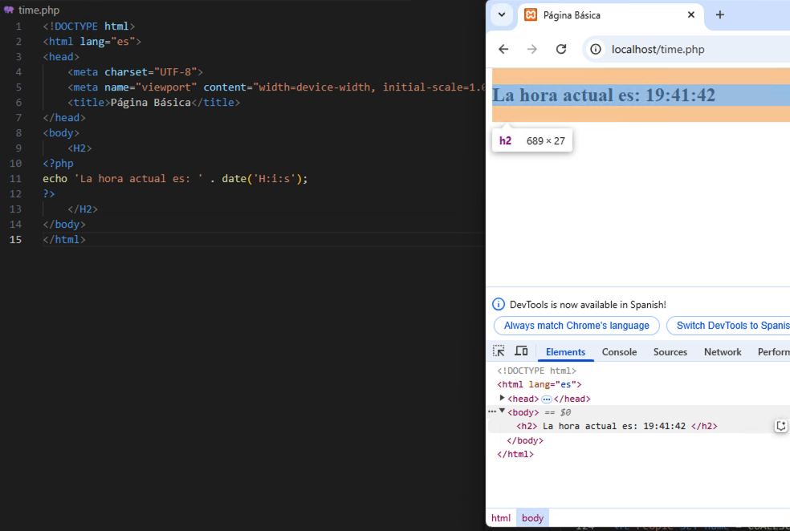

Para poder ampliar estas prestaciones de Apache se deben instalar módulos adicionales. Por ejemplo, para poder servir páginas PHP, es necesario instalar un intérprete de PHP en el servidor. La buena noticia es que XAMPP ya incluye PHP, por lo que no es necesario instalar nada adicional para poder servir páginas PHP en nuestro caso.

La cuestión que cabe plantearse ahora es dónde almacenar el contenido propio que vamos a desarrollar para poder acceder a él a través del servidor web, ya que hasta ahora nos hemos limitado a ver la página de inicio de XAMPP. Para ello es muy importante conocer el concepto de *carpeta de publicación*. La carpeta de publicación es el directorio del servidor en el que se almacenan los archivos que se desean servir a través del servidor web. Todos los archivos que se encuentren en la carpeta de publicación estarán accesibles a través del servidor web. Por defecto, la carpeta de publicación de Apache es el directorio `htdocs`, que se encuentra en el directorio de instalación de XAMPP. Todos los archivos que se encuentren en el directorio `htdocs` estarán accesibles a través del servidor web. Si se han seguido los pasos de este tutorial la carpeta de publicación será `C:\xampp\htdocs`. Por ejemplo, si se crea un archivo `index.html` en el directorio `C:\xampp\htdocs`, se podrá acceder a él a través de la dirección `http://localhost/index.html`.

#### Creación de un archivo PHP

Es el momento de probar el entorno con un script propio en PHP. Para ello, se deberá crear un archivo con extensión `.php` en el directorio `C:\xampp\htdocs`, la carpeta de publicación de Apache. Para ello, se puede utilizar un editor de código como Notepad++ o Visual Studio Code. Por ejemplo, se puede crear un archivo llamado `hello.php` con el siguiente contenido:

[source,php]
----
<?php
echo "¡Hola a todos!";
?>
----

Tras crear el archivo `hello.php`, se deberá abrir un navegador web y acceder a la dirección `http://localhost/hello.php`. Si se muestra el mensaje "¡Hola, Mundo!", significa que PHP está funcionando correctamente. La figura siguiente muestra el mensaje que se muestra al acceder a la dirección `http://localhost/hello.php`.

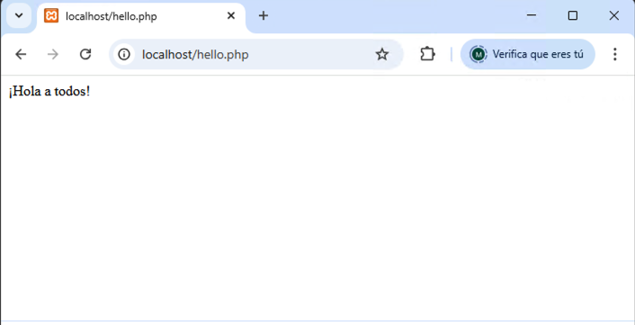

[NOTE]
====
Si el archivo `hello-world.php` se almacena en una subcarpeta de `htdocs`, como  `tutorialphp` (p.e. `C:\xampp\htdocs\tutorialphp\hello-world.php`), se deberá acceder a la dirección `http://localhost/tutorialphp/hello-world.php` para ver el mensaje. Es decir, las subcarpetas de `htdocs` se reflejan en la URL.
====

### Instalación de Composer

Composer es un administrador de dependencias para PHP que facilita la gestión de las dependencias de un proyecto PHP. Composer permite instalar y actualizar bibliotecas de terceros, así como gestionar las dependencias de un proyecto PHP de forma sencilla. Composer utiliza un archivo `composer.json` para definir las dependencias de un proyecto y un archivo `composer.lock` para bloquear las versiones de las dependencias. Composer se instala a nivel de sistema y se puede utilizar en cualquier proyecto PHP. En nuestro caso usaremos Composer para instalar Slim Framework, un microframework PHP para el desarrollo de APIs RESTful.

Para instalar Composer, se deberá descargar el instalador desde la página web oficial https://getcomposer.org/download/[Composer, target="_blank]. Se puede descargar el https://getcomposer.org/Composer-Setup.exe[instalador para Windows, target="_blank] y ejecutarlo. Durante la instalación, se seguirán las opciones predeterminadas y se instalará en una carpeta independiente de XAMPP (p.e. `C:\composer`). Tras la instalación, se deberá abrir una terminal y ejecutar el comando `composer` para comprobar que Composer se ha instalado correctamente. Si Composer se ha instalado correctamente, se mostrará un mensaje con la versión de Composer y los comandos disponibles, como se muestra a continuación:

[source]
----
composer
   ______
  / ____/___  ____ ___  ____  ____  ________  _____
 / /   / __ \/ __ `__ \/ __ \/ __ \/ ___/ _ \/ ___/
/ /___/ /_/ / / / / / / /_/ / /_/ (__  )  __/ /
\____/\____/_/ /_/ /_/ .___/\____/____/\___/_/
                    /_/
Composer version 2.7.6 2024-05-04 23:03:15

Usage:
  command [options] [arguments]

Options:
  -h, --help                     Display help for the given command. When no command is given display help for the list command
  -q, --quiet                    Do not output any message
  -V, --version                  Display this application version
      --ansi|--no-ansi           Force (or disable --no-ansi) ANSI output
...
----

### Herramientas para pruebas de APIs

Existen varias herramientas que permiten a los desarrolladores probar y depurar APIs. Algunas de las herramientas más populares son:

* https://www.postman.com/[Postman, target="_blank]: Es una herramienta de desarrollo de APIs que permite a los desarrolladores enviar solicitudes HTTP, ver las respuestas y realizar pruebas automatizadas. Postman proporciona una interfaz gráfica que facilita la creación y envío de solicitudes, así como la visualización de las respuestas. Además, cuenta con un servicio en la nube que permite compartir colecciones de solicitudes con otros desarrolladores.
* `cURL`: Es una herramienta de línea de comandos que permite enviar solicitudes HTTP y ver las respuestas.
* https://insomnia.rest/[Insomnia, target="_blank]: Es una herramienta similar a Postman que permite enviar solicitudes HTTP y ver las respuestas.

### Instalación de Slim Framework

https://www.slimframework.com/[Slim, target=_blank] es un microframework PHP que permite crear aplicaciones web rápidas y sencillas. En nuestro caso lo usaremos para crear una API REST que permita la comunicación entre el frontend y la base de datos. Antes tendremos que realizar una configuración en el servidor Apache para que pueda interpretar las rutas de Slim.

#### Configuración general de Apache para Slim

Para que Apache pueda interpretar las rutas de Slim, se debe habilitar la reescritura de URLs en la configuración de Apache. La reescritura de URLs permite modificar la URL de una petición HTTP antes de que sea procesada por el servidor web. En el caso de Slim, la reescritura de URLs es necesaria para que Apache pueda interpretar las rutas de Slim y dirigir las peticiones al archivo de entrada de la aplicación. 

Para ello, se debe modificar el archivo de configuración de Apache `httpd.conf`. En el panel de control de XAMPP, hacer click en el botón `Config` de Apache y seleccionar la opción `httpd.conf`. Se abrirá un archivo de configuración de Apache en el editor de texto por defecto. Cambiaremos la configuración de `<Directory>` para que permita la reescritura de URLs. Para ello, se debe cambiar la directiva `AllowOverride None` por `AllowOverride All`. El bloque de configuración debería quedar de la siguiente forma:

```apache
<Directory />
    Options Indexes FollowSymLinks
    AllowOverride All
    Require all granted
</Directory>
```

#### Proceso de instalación de Slim

Dentro de la carpeta raíz del proyecto, crear un archivo `composer.json` con el siguiente contenido:

```json
{
  "name": "slim/slim-skeleton",
  "description": "A Slim Framework skeleton application for rapid development",
  "autoload": {
    "psr-4": {
      "App\\": "src/"
    }
  },
  "require": {
    "php": "^8.1",
    "slim/slim": "4.*",
    "nyholm/psr7": "^1.8",
    "nyholm/psr7-server": "^1.1",
    "laminas/laminas-diactoros": "^3.3"
  },
  "scripts": {
    "server": "php -S localhost:8000 -t public"
  },
  "config": {
    "process-timeout": 0
  }
}
```

Tras crear el archivo, abrir una terminal en la carpeta raíz del proyecto y ejecutar `composer install`. Composer descargará las dependencias necesarias para Slim y las instalará en la carpeta `vendor`. Como consecuecia, Slim Framework quedara instalado en el proyecto.

#### Configuración de Apache en la aplicación

Para que Apache pueda interpretar las rutas de Slim en el proyecto, se deben crear dos archivos `.htaccess`, uno en la carpeta raíz del proyecto y otro en la carpeta `public`. 

El archivo `.htaccess` de la carpeta raíz debe contener lo siguiente:

```apache
RewriteEngine on
RewriteRule ^$ public/ [L]
RewriteRule (.*) public/$1 [L]
```

El archivo `.htaccess` de la carpeta `public` debe contener lo siguiente:

```apache
RewriteEngine On
RewriteCond %{REQUEST_FILENAME} !-f
RewriteCond %{REQUEST_FILENAME} !-d
RewriteRule ^ index.php [QSA,L]
```

Tras realizar estos cambios, se debe reiniciar el servicio de Apache desde el panel de control de XAMPP.

#### Creación de una ruta de prueba

Para comprobar que Slim está funcionando correctamente, se puede crear una ruta de prueba en el archivo `public/index.php`:

```php
<?php

require dirname(__DIR__) . '/vendor/autoload.php';

use Psr\Http\Message\RequestInterface;
use Psr\Http\Message\ResponseInterface;
use Slim\Factory\AppFactory;

// Create the application
$app = AppFactory::create();

// Define the application routes
$app->get('/', function (RequestInterface $request, ResponseInterface $response, array $args) { <1>
    // Set the response content type
    header('Content-Type: application/json; charset=utf-8');

    // Set the response status code
    $data['status'] = 200;

    // Set the response data
    $data['message'] = 'Hello from Slim';

    // Write the response
    $response->getBody()->write(json_encode($data));

    // Return the response
    return $response;
});

// Set the base path of the application
$app->setBasePath('/sample-rest-api'); <2>

// Run the application
$app->run();
```
<1> Endpoint de prueba que devuelve un mensaje JSON.
<2> Ruta base de la API.

[IMPORTANT]
====
En este archivo no debemos olvidar cambiar la ruta base de la API, en este caso `/sample-rest-api`, por la que vayamos a utilizar en nuestro proyecto (`$app->setBasePath('/sample-rest-api');`). Tras realizar estos cambios, al acceder a la ruta `http://localhost/sample-rest-api` desde un navegador se debería ver un mensaje JSON con el contenido `{"status":200,"message":"Hello from Slim"}`.
====

Podemos probar esta ruta accediendo a la dirección `http://localhost/sample-rest-api` desde un navegador. Si se muestra el mensaje JSON, significa que Slim está funcionando correctamente y que la configuración de Apache es correcta. La figura siguiente muestra el mensaje JSON que se muestra al acceder a la dirección `http://localhost/sample-rest-api`.

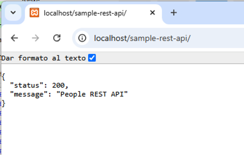

También es posible probar esta ruta con `cURL` desde la terminal:

```bash
curl http://localhost/sample-rest-api
```

Esto nos devolvería la siguiente respuesta, donde el contenido se encuentra en el campo `Content`:

```bash
 curl http://localhost/sample-rest-api


StatusCode        : 200
StatusDescription : OK
Content           : {"status":200,"message":"People REST API"}
RawContent        : HTTP/1.1 200 OK
                    Content-Length: 42
                    Content-Type: application/json; charset=utf-8
                    Date: Fri, 14 Feb 2025 13:16:12 GMT
                    Server: Apache/2.4.58 (Win64) OpenSSL/3.1.3 PHP/8.2.12
                    X-Powered-By: PHP/8.2.1...
Forms             : {}
Headers           : {[Content-Length, 42], [Content-Type, application/json; charset=utf-8], [Date, Fri, 14 Feb 2025
                    13:16:12 GMT], [Server, Apache/2.4.58 (Win64) OpenSSL/3.1.3 PHP/8.2.12]...}
Images            : {}
InputFields       : {}
Links             : {}
ParsedHtml        : mshtml.HTMLDocumentClass
RawContentLength  : 42
```
Por último, también es posible probar este endpoint lanzando la petición con Postman. Para ello, basta con elegir el método `GET`, introducir la URL a la que se dirige la petición (`http://localhost/sample-rest-api`) y pulsar el botón `Send`. La respuesta será similar a la que se muestra en la figura siguiente.

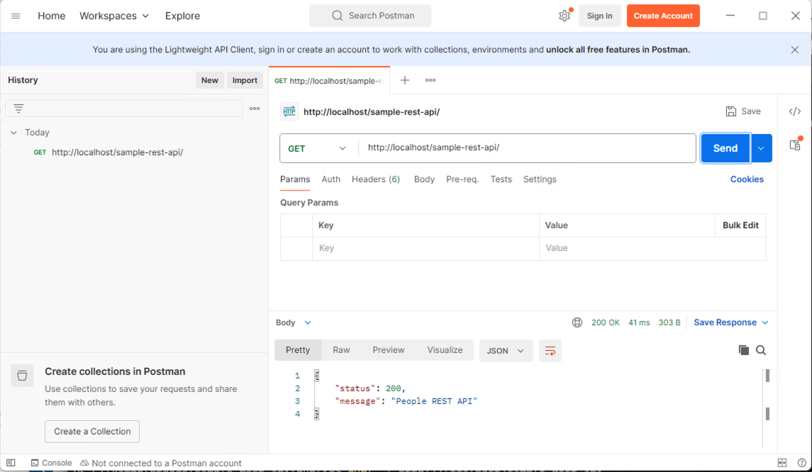

## Desarrollo básico en PHP

PHP es un lenguaje de programación de propósito general que se adapta especialmente al desarrollo web. Permite la creación de páginas web dinámicas y la interacción con bases de datos, entre otras funcionalidades. En este apartado se explicarán los conceptos básicos de PHP, como variables, operadores, estructuras de control, funciones, arrays, formularios, etc.

### Operaciones básicas

Un archivo en PHP puede contener código PHP y código HTML. El código PHP se encierra entre las etiquetas `<?php` y `?>`, y el código HTML se escribe fuera de estas etiquetas. Al ser PHP un lenguaje interpretado, se ejecutará secuencialmente, línea por línea, y se mostrará el resultado en el navegador. Además, al poder intercalarse código PHP y HTML, se pueden realizar operaciones en PHP y mostrar el resultado en el navegador.

En cuanto a la sintaxis, destacar los siguiente:

* No es sensible a mayúsculas y minúsculas, por lo que no importa si se escribe en mayúsculas o minúsculas.
* Las variables en PHP se definen con el símbolo `$` seguido del nombre de la variable. No es necesario definir el tipo de la variable, ya que PHP es un lenguaje de tipado dinámico. Tampoco es necesario declarar las variables antes de usarlas.
* Las estructuras de control, como `if`, `else`, `while`, `for`, etc., son similares a las de otros lenguajes de programación como Java, C o C++.
* Las funciones en PHP se definen con la palabra clave `function` seguida del nombre de la función y los paréntesis `()`. Dentro de los paréntesis se pueden definir los parámetros de la función.
* Los comentarios en PHP se pueden realizar de dos formas: con `//` para comentarios de una línea y con `/* */` para comentarios de varias líneas.

A continuación se muestran algunos ejemplos de operaciones básicas en PHP:

[source,php]
----
<?php
// Operaciones aritméticas
$a = 5;
$b = 10;
$suma = $a + $b;
$resta = $a - $b;
$multiplicacion = $a * $b;
$division = $a / $b;

echo "Suma: " . $suma . "<br>";
echo "Resta: " . $resta . "<br>";
echo "Multiplicación: " . $multiplicacion . "<br>";
echo "División: " . $division . "<br>";

// Concatenación de cadenas
$cadena1 = "Hola";
$cadena2 = "Mundo";
$cadena3 = $cadena1 . " " . $cadena2;

echo $cadena3 . "<br>";

// Estructuras de control
if ($a > $b) {
    echo "$a es mayor que $b<br>";
} else {
    echo "$a no es mayor que $b<br>";
}

for ($i = 0; $i < 5; $i++) {
    echo "El valor de i es: $i<br>";
}

// Funciones
function saludar($nombre) {
    return "Hola, " . $nombre . "<br>";
}

echo saludar("María");
?>
----

La figura siguiente muestra el resultado de ejecutar el código PHP anterior en un navegador web.

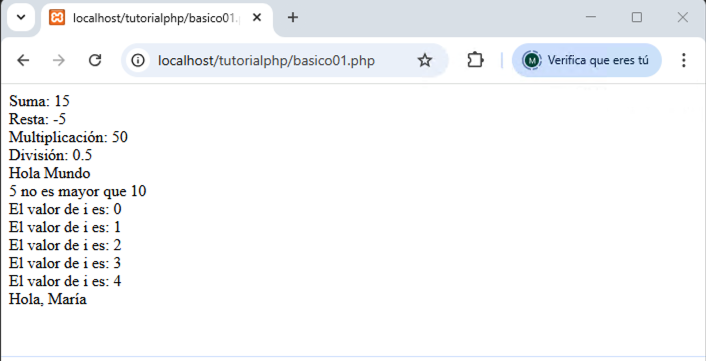

### Control de flujo

El control de flujo en PHP se realiza mediante estructuras de control como `if`, `else`, `elseif`, `while`, `do-while`, `for`, `foreach`, `switch`, etc. Estas estructuras de control permiten controlar el flujo de ejecución del programa en función de ciertas condiciones. A continuación se muestran algunos ejemplos de control de flujo en PHP:

[source,php]
----
<?php
// Estructura if-else
$numero = 10;
if ($numero > 0) {
    echo "$numero es positivo<br>";
} else {
    echo "$numero es negativo o cero<br>";
}

// Estructura switch
$dia = "lunes";
switch ($dia) {
    case "lunes":
        echo "Hoy es lunes<br>";
        break;
    case "martes":
        echo "Hoy es martes<br>";
        break;
    default:
        echo "Hoy no es ni lunes ni martes<br>";
}

// Bucle while
$i = 0;
while ($i < 5) {
    echo "El valor de i es: $i<br>";
    $i++;
}

// Bucle do-while
$j = 0;
do {
    echo "El valor de j es: $j<br>";
    $j++;
} while ($j < 5);

// Bucle for
for ($k = 0; $k < 5; $k++) {
    echo "El valor de k es: $k<br>";
}

// Bucle foreach
$frutas = ["manzana", "naranja", "plátano"];
foreach ($frutas as $fruta) {
    echo "Fruta: $fruta<br>";
}
?>
----

La figura siguiente muestra el resultado de ejecutar el código PHP anterior en un navegador web.

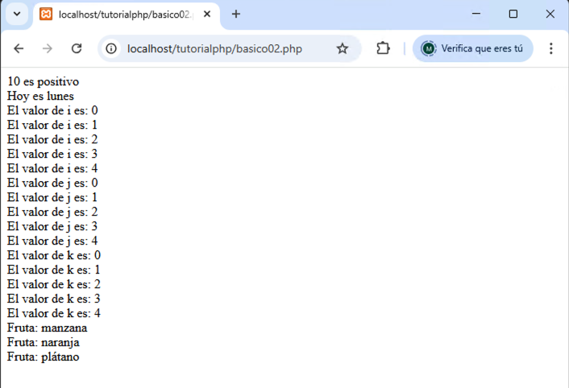

### Funciones

Las funciones en PHP permiten encapsular un bloque de código que puede ser reutilizado en diferentes partes del programa. Las funciones pueden recibir parámetros y devolver valores. A continuación se muestran algunos ejemplos de funciones en PHP:

[source,php]
----
<?php
// Función sin parámetros
function saludar() {
    return "Hola, Mundo!<br>";
}

echo saludar();

// Función con un parámetro
function saludarPersona($nombre) {
    return "Hola, " . $nombre . "!<br>";
}

echo saludarPersona("María");

// Función con múltiples parámetros
function sumar($a, $b) {
    return $a + $b;
}

echo "La suma de 5 y 10 es: " . sumar(5, 10) . "<br>";

// Función con parámetros por defecto
function saludarConTitulo($nombre, $titulo = "Sr./Sra.") {
    return "Hola, " . $titulo . " " . $nombre . "!<br>";
}

echo saludarConTitulo("María");
echo saludarConTitulo("María", "Dra.");

// Función con tipo de retorno
function multiplicar($a, $b): int {
    return $a * $b;
}

echo "La multiplicación de 5 y 10 es: " . multiplicar(5, 10) . "<br>";
?>
----

La figura siguiente muestra el resultado de ejecutar el código PHP anterior en un navegador web.

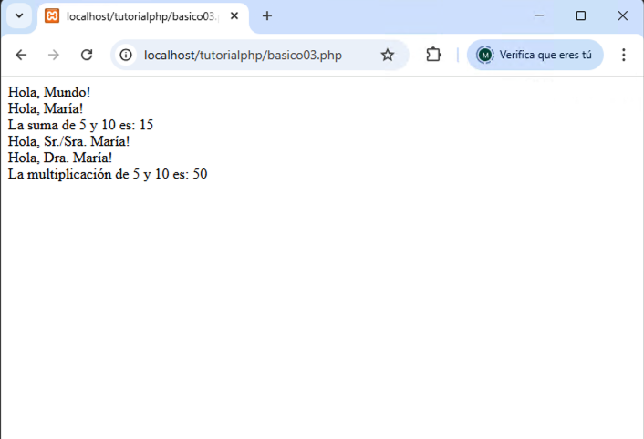

### Funciones de devolución de llamada (callbacks)

Las funciones de devolución de llamada o funciones de callback son funciones que se pasan como argumentos a otras funciones y se ejecutan en un momento posterior. Las funciones de callback son útiles para manejar eventos asíncronos, como métodos de una API, o para aplicar una función a cada elemento de un array. A continuación se muestran algunos ejemplos de funciones de callback en PHP:

[source,php]
----
<?php
// Función de callback simple
function procesar($callback) {
    // Llamar a la función de callback
    $callback();
}

function miCallback() {
    echo "Hola desde la función de callback!<br>";
}

// Pasar la función de callback como argumento
procesar('miCallback');

// Función de callback con parámetros
function procesarConParametros($callback, $parametro) {
    // Llamar a la función de callback con un parámetro
    $callback($parametro);
}

function miCallbackConParametros($mensaje) {
    echo "Mensaje desde la función de callback: " . $mensaje . "<br>";
}

// Pasar la función de callback con un parámetro
procesarConParametros('miCallbackConParametros', 'Hola, Mundo!');

// Función de callback anónima
procesar(function() {
    echo "Hola desde una función de callback anónima!<br>";
});

// Función de callback con array_map
$numeros = [1, 2, 3, 4, 5];
$cuadrados = array_map(function($numero) {
    return $numero * $numero;
}, $numeros);

print_r($cuadrados);
?>
----

La figura siguiente muestra el resultado de ejecutar el código PHP anterior en un navegador web.

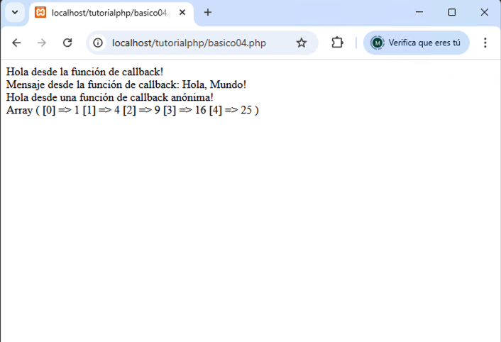

### Uso de arrays

Los arrays en PHP son estructuras de datos que permiten almacenar múltiples valores en una sola variable. Los arrays pueden ser indexados numéricamente o asociativos, a los que se accede mediante un índice o una clave. Los arrays indexados numéricamente utilizan índices numéricos para acceder a los elementos, mientras que los arrays asociativos utilizan claves. Los arrays en PHP son dinámicos, lo que significa que pueden cambiar de tamaño durante la ejecución del programa. Además, los arrays en PHP pueden contener diferentes tipos de datos, como enteros, cadenas, booleanos, etc. A continuación se muestran algunos ejemplos de uso de arrays en PHP:

[source,php]
----
<?php
// Array indexado numéricamente
$frutas = ["manzana", "naranja", "plátano"];
echo "La primera fruta es: " . $frutas[0] . "<br>";

// Array asociativo
$persona = [
    "nombre" => "María",
    "edad" => 25,
    "ciudad" => "Madrid"
];
echo "El nombre es: " . $persona["nombre"] . "<br>";

// Recorrer un array indexado numéricamente con un bucle for
for ($i = 0; $i < count($frutas); $i++) {
    echo "Fruta: " . $frutas[$i] . "<br>";
}

// Recorrer un array asociativo con un bucle foreach
foreach ($persona as $clave => $valor) {
    echo "$clave: $valor<br>";
}

// Añadir elementos a un array
$frutas[] = "pera";
echo "La última fruta es: " . $frutas[count($frutas) - 1] . "<br>";

// Eliminar elementos de un array
unset($frutas[1]);
echo "Después de eliminar, la segunda fruta es: " . $frutas[1] . "<br>";
?>
----

La figura siguiente muestra el resultado de ejecutar el código PHP anterior en un navegador web.

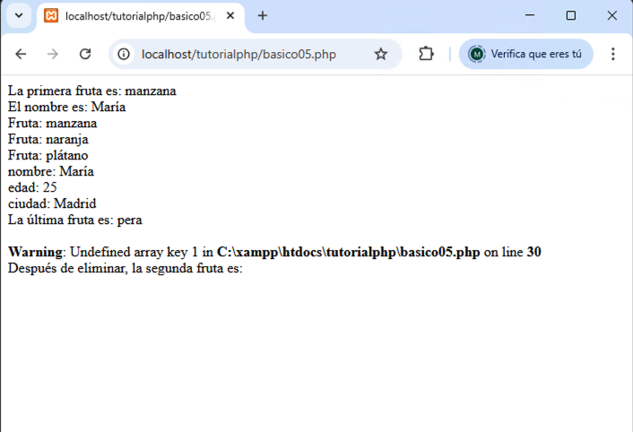

PHP ofrece una gran cantidad de funciones para el manejo de arrays, como `count`, `array_push`, `array_pop`, `array_shift`, `array_unshift`, `array_slice`, `array_splice`, `array_merge`, `array_keys`, `array_values`, `array_filter`, `array_search`, etc. Estas funciones permiten añadir, eliminar, modificar y recorrer los elementos de un array de forma sencilla y eficiente. Veamos un ejemplo de uso de algunas de estas funciones:

* `count`: Devuelve el número de elementos de un array.
+
[source,php]
----
$frutas = ["manzana", "naranja", "plátano"];
echo "El número de frutas es: " . count($frutas) . "<br>";
----
* `array_map`: Aplica una función a cada elemento de un array y devuelve un nuevo array con los resultados.
+
[source,php]
----
$numeros = [1, 2, 3, 4, 5];
$cuadrados = array_map(function($numero) {
    return $numero * $numero;
}, $numeros);
print_r($cuadrados);
----
* `array_shift`: Elimina el primer elemento de un array y lo devuelve.
+
[source,php]
----
$frutas = ["manzana", "naranja", "plátano"];
$fruta = array_shift($frutas);
echo "La primera fruta es: " . $fruta . "<br>";
----
* `array_filter`: Filtra los elementos de un array utilizando una función de devolución de llamada.
+
[source,php]
----
$edades = [25, 30, 35, 40, 45];
$mayoresDe30 = array_filter($edades, function($edad) {
    return $edad > 30;
});
print_r($mayoresDe30);
----

### Formularios en PHP

Los formularios son una parte fundamental de las aplicaciones web, ya que permiten a los usuarios introducir datos que serán enviados al servidor para su procesamiento. En PHP, los datos de un formulario se envían al servidor a través del método `POST` o `GET`. El método `POST` envía los datos al servidor de forma no visible, mientras que el método `GET` envía los datos al servidor a través de la URL. En general, se utiliza el método `POST` para enviar datos sensibles, como contraseñas, y el método `GET` para enviar datos no sensibles. A continuación se muestra un ejemplo de URL que envía datos a través del método `GET`:

[source]
----
http://localhost/procesar.php?nombre=María&edad=25
----

En este caso, se envían los datos `nombre=María` y `edad=25` al archivo `procesar.php` a través del método `GET`. En PHP, los datos enviados a través del método `GET` se almacenan en un array asociativo llamado `$_GET`. Por ejemplo, para acceder al valor del parámetro `nombre`, se puede utilizar `$_GET['nombre']`.

A continuación se muestra un ejemplo de un formulario HTML que envía datos a través del método `POST`. El formulario contiene dos campos, uno para el nombre y otro para la edad. Llamaremos a este formulario `formulario.html`. Este formulario enviará los datos al archivo `procesar.php` a través del método `POST`.

[source,html]
----
<form action="procesar.php" method="post">
    Nombre: <input type="text" name="nombre"><br>
    Edad: <input type="text" name="edad"><br>
    <input type="submit" value="Enviar">
</form>
----

En este caso, los datos del formulario se envían al archivo `procesar.php` a través del método `POST`. En PHP, los datos enviados a través del método `POST` se almacenan en un array asociativo llamado `$_POST`. Por ejemplo, para acceder al valor del parámetro `nombre`, se puede utilizar `$_POST['nombre']`.

A continuación se muestra un ejemplo de cómo procesar los datos enviados por el formulario en PHP. Llamaremos a este archivo `procesar.php`.

[source,php]
----
<?php
$nombre = $_POST['nombre'];
$edad = $_POST['edad'];

echo "Nombre: " . $nombre . "<br>";
echo "Edad: " . $edad . "<br>";
?>
----

En este ejemplo, se accede a los datos del formulario a través del array `$_POST` y se muestran en el navegador utilizando la función `echo`.

[NOTE]
====
Si el formulario envía los datos a través del método `GET`, se deberá acceder a los datos a través del array `$_GET` en lugar de `$_POST`.
====

[TIP]
====
Es importante validar y sanitizar los datos recibidos a través de formularios para evitar ataques de inyección de código y otros tipos de ataques. PHP proporciona funciones como `filter_var` y `htmlspecialchars` para validar y sanitizar datos.
====

La figura siguiente ilustra a la izquierda el formulario y a la derecha el resultado de procesar los datos del formulario tras enviarlo.

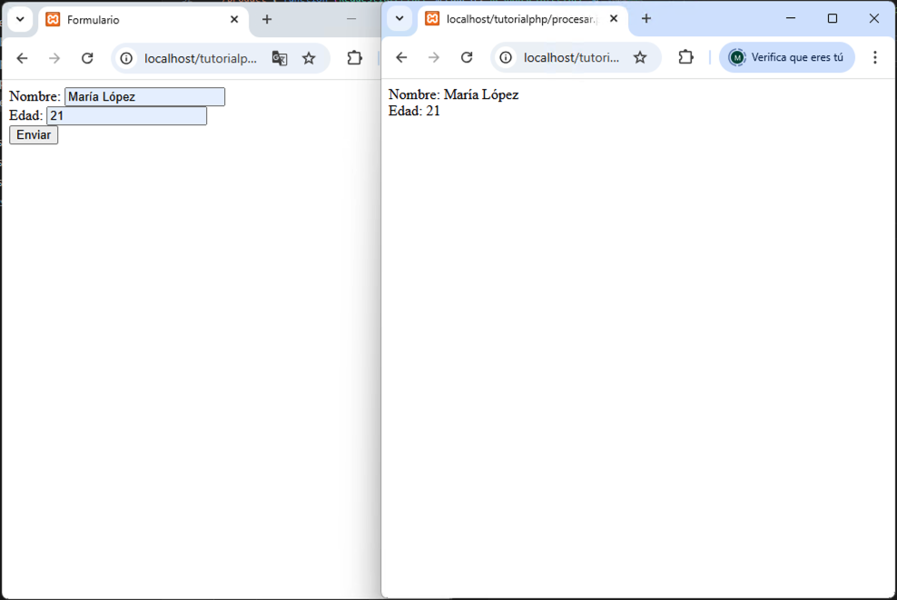

## Bases del desarrollo de APIs

Una API (Application Programming Interface) es un conjunto de definiciones y protocolos que permiten que diferentes aplicaciones se comuniquen entre sí. Las APIs definen la forma en que los desarrolladores pueden interactuar con una aplicación o servicio, proporcionando un conjunto de funciones y procedimientos que pueden ser utilizados para realizar tareas específicas.

Las APIs funcionan como intermediarios entre diferentes sistemas, permitiendo que una aplicación solicite datos o servicios de otra aplicación y reciba una respuesta. Esto se logra mediante el uso de solicitudes y respuestas HTTP, donde una aplicación envía una solicitud a una API y la API devuelve una respuesta con los datos solicitados.

### API y API REST

Una API REST (Representational State Transfer) es un tipo de API que sigue los principios de la arquitectura REST. REST es un estilo de arquitectura que utiliza HTTP para realizar operaciones CRUD (Create, Read, Update, Delete) en recursos. En nuestro caso, los recursos normalmente serán tablas de una base de datos. Las APIs RESTful son diseñadas para ser simples, escalables y eficientes, utilizando métodos HTTP estándar y formatos de intercambio de datos como JSON y XML.

La principal diferencia entre una API y una API REST es que las APIs RESTful siguen los principios de la arquitectura REST, mientras que otras APIs pueden no seguir estos principios. Las APIs RESTful utilizan métodos HTTP estándar (GET, POST, PUT, DELETE) para realizar operaciones en recursos y utilizan URLs para identificar recursos específicos.

La figura siguiente ilustra las peticiones a una API RESTful utilizando los métodos HTTP estándar GET, POST, PUT y DELETE. Estas peticiones son enviadas a través de URLs que identifican los recursos específicos. Al ser recibidas por la API RESTful, se procesan (interactuando con la base de datos) y se envían las respuestas correspondientes.

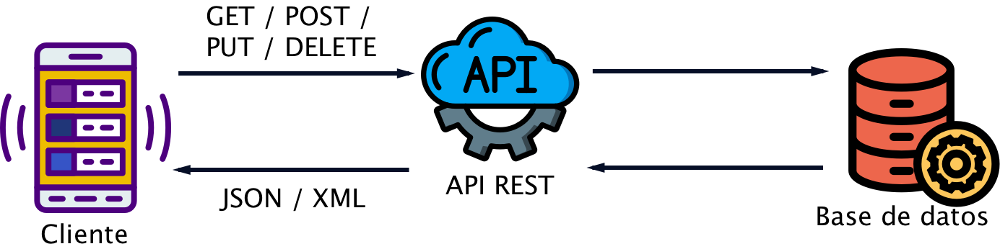

.Importancia de las APIs en el contexto de las bases de datos
****
Desde el punto de vista de las bases de datos, estamos interesados en desarrollar APIs que permitan a las aplicaciones web interactuar con bases de datos. En este sentido, las APIs RESTful son un enfoque común para desarrollar APIs que permiten a las aplicaciones web realizar operaciones CRUD (Create, Read, Update, Delete) en bases de datos. Este enfoque permite a los desarrolladores interactuar con las bases de datos de forma sencilla y eficiente utilizando métodos HTTP estándar y formatos de intercambio de datos como JSON y XML sin necesidad de interactuar con la base de datos a través de consultas ejecutadas desde un cliente SQL. Además, ocultan los detalles de implementación de la base de datos y proporcionan una capa de abstracción que facilita el desarrollo de aplicaciones web. Por ejemplo, la URL siguiente permite recuperar el producto 1 de una base de datos mediante una API RESTful sin conocer los detalles de implementación de la base de datos. 

http://api.example.com/product/1

Al realizar la petición, no se conoce si la base de datos es MySQL, PostgreSQL, MongoDB, etc., ni cómo se almacenan los datos en la base de datos. La API RESTful proporciona una interfaz sencilla y estandarizada para interactuar con la base de datos.

Posteriormente, se podrían realizar cambios en la tecnología subyacente de la base de datos (p.e. cambiar de DBMS) o en la forma en que se almacenan los datos (cambiar el modelo de datos) sin afectar a las aplicaciones web que utilizan la API RESTful. Bastaría con modificar la implementación interna de la API RESTful para adaptarse a los cambios en la base de datos manteniendo la misma interfaz (contrato) para el cliente, es decir, manteniedo la estructura de las URLs y los métodos HTTP. Este enfoque facilita la evolución de las aplicaciones web y la escalabilidad del sistema proporcionando una capa de abstracción entre las aplicaciones web y la base de datos.

Desde el punto de vista de la seguridad, la API puede ser protegida mediante autenticación y autorización, lo que permite controlar el acceso a los recursos y proteger los datos de la base de datos. Por ejemplo, se pueden utilizar tokens de acceso (JWT) para autenticar a los usuarios y roles para autorizar el acceso a los recursos. De esta forma, se puede garantizar que sólo los usuarios autorizados puedan acceder a los datos de la base de datos y realizar operaciones en los recursos.
****

### Métodos HTTP (GET, POST, PUT, DELETE)

Los métodos HTTP son utilizados para realizar operaciones en recursos en una API RESTful. Los métodos más comunes son:

* `GET`: Recupera información de un recurso específico.
* `POST`: Crea un nuevo recurso.
* `PUT`: Actualiza un recurso existente.
* `DELETE`: Elimina un recurso.

Cada uno de estos métodos tiene un propósito específico y se utiliza en diferentes situaciones para interactuar con los recursos de una API. Desde el punto de vista de bases de datos, cada uno lo podríamos hacer corresponder con una operación básica de SQL CRUD:

* `GET`: Correspondería a una operación `SELECT` para recuperar información de un recurso específico.
* `POST`: Correspondería a una operación `INSERT` para crear un nuevo recurso.
* `PUT`: Correspondería a una operación `UPDATE` para actualizar un recurso existente.
* `DELETE`: Correspondería a una operación `DELETE` para eliminar un recurso.

### Formatos de intercambio de datos (JSON, XML)

Los formatos de intercambio de datos son utilizados para representar la información que se envía y recibe a través de una API. Los dos formatos más comunes son JSON (JavaScript Object Notation) y XML (eXtensible Markup Language).

* `JSON`: Es un formato ligero y fácil de leer que utiliza una sintaxis basada en objetos de JavaScript. Es ampliamente utilizado en APIs RESTful debido a su simplicidad y eficiencia.
+
[source,json]
----
[
    {
        "id": 1,
        "name": "Product 1",
        "price": 10.00
    },
    {
        "id": 2,
        "name": "Product 2",
        "price": 20.00
    }
]
----
* `XML`: Es un formato más complejo que utiliza una sintaxis basada en etiquetas. Aunque es más pesado que JSON, es utilizado en algunas APIs debido a su capacidad para representar datos estructurados de manera más detallada.
+
[source,xml]
----
<products>
    <product>
        <id>1</id>
        <name>Product 1</name>
        <price>10.00</price>
    </product>
    <product>
        <id>2</id>
        <name>Product 2</name>
        <price>20.00</price>
    </product>
</products>
----

### Especificación de los endpoints de una API

Los endpoints de una API son las URLs a las que se envían las solicitudes para interactuar con los recursos de la API. Cada endpoint representa una operación específica que se puede realizar en un recurso. Como ejemplos de endpoints, se pueden mencionar:

* `GET /product`: Recupera la lista de todos los productos.
* `GET /product/{id}`: Recupera la información de un producto específico.
* `POST /product`: Crea un nuevo producto. El producto se envía en el cuerpo de la solicitud, normalmente en formato JSON o XML.

A continuación se explican algunos aspectos importantes sobre cómo especificar los endpoints de una API.

#### Paso de parámetros en la URL

Los parámetros en la URL se utilizan para identificar recursos específicos o para pasar información adicional a la API. Los parámetros pueden ser parte de la ruta de la URL o pueden ser parámetros de consulta.

* **Parámetros en la ruta de la URL**: Se utilizan para identificar recursos específicos. Por ejemplo, en la URL `http://api.example.com/product/1`, el parámetro `1` identifica al usuario con ID 1. En la especificación de una API, esto se puede representar como `GET /product/{id}`.
* **Parámetros de consulta**: También como `QueryParams`, se utilizan para pasar información adicional a la API. Por ejemplo, en la URL `http://api.example.com/product?name=Product 1`, el parámetro de consulta `name=Product 1` se utiliza para buscar productos con el nombre "Product 1". En la especificación de una API, esto se puede representar como `GET /product?name=<name>`.

#### Envío de datos en peticiones POST y PUT

En las peticiones POST y PUT, los datos a añadir o a modificar, respectivamente, se envían en el cuerpo de la solicitud (`body`). Estos datos pueden estar en formato JSON, XML u otros formatos. A continuación se muestra un ejemplo del cuerpo en una petición POST utilizando JSON:

```json
{
    "name": "Product 1",
    "price": 10.00
}
```

La figura siguiente ilustra cómo especificar este cuerpo en una solicitud `POST` a través de Postman.

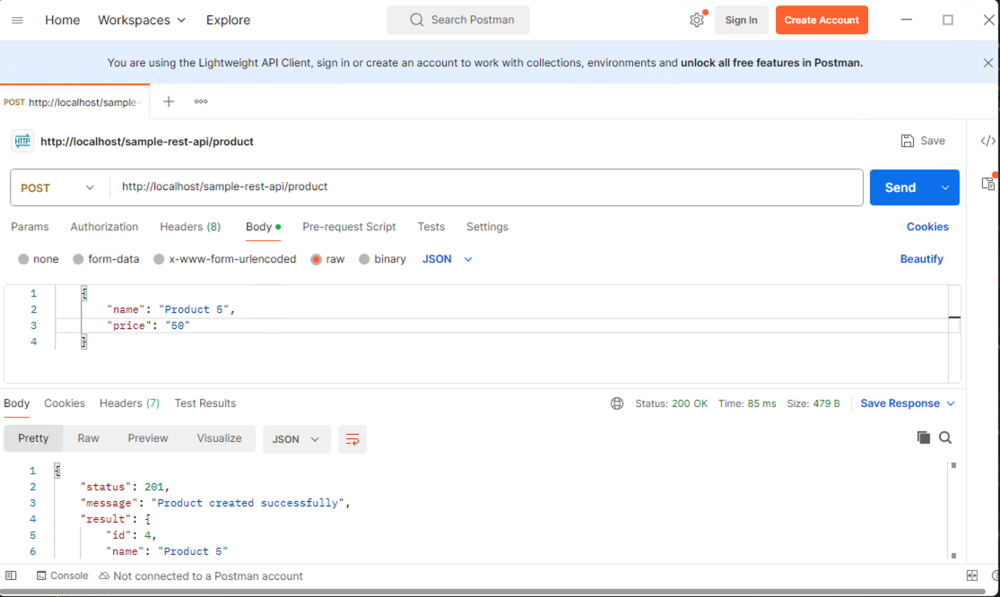

[NOTE]
====
La especificación del cuerpo se realiza en la pestaña `Body` de Postman. En este caso, se ha seleccionado el formato `raw` y se ha introducido el cuerpo en formato JSON seleccionando `JSON` en el menú desplegable.
====

En este ejemplo, se envían los datos de un usuario en formato JSON en el cuerpo de la solicitud POST. En la especificación de una API, esto se puede representar como `POST /product`.

En el caso de una petición `PUT`, se enviarían los datos de la misma forma, pero se utilizaría el método `PUT` en lugar de `POST`. En la especificación de una API, esto se puede representar como `PUT /product/{id}`.

[NOTE]
====
Las peticiones `POST` no incluyen un identificador en la URL. Sólo se incorpora en el cuerpo de la solicitud la información necesaria para crear un nuevo recurso. De la generación del identificador se encarga el servidor. En términos de base de datos, sería el campo `id` de la tabla y sería generado automáticamente por el sistema de gestión de base de datos. Por otro lado, las peticiones `PUT` sí incluyen un identificador en la URL, ya que se es necesario para identificar el recurso que se va a modificar.
====

#### Respuestas de la API

Las respuestas de una API RESTful pueden ser en formato JSON, XML u otros formatos. Es una buena práctica que las respuestas, además incluyan un código de estado HTTP que indica si la solicitud se ha completado correctamente o si ha habido algún error. Algunos códigos de estado HTTP comunes son:

* `200 OK`: La solicitud se ha completado correctamente.
* `201 Created`: El recurso se ha creado correctamente. Se utiliza en respuestas a peticiones `POST`.
* `400 Bad Request`: La solicitud no se ha podido procesar debido a un error en la solicitud.
* `404 Not Found`: El recurso solicitado no se ha encontrado. Esto debería entenderse como una llamada a un endpoint que no existe, y no como un recurso que no se ha encontrado (p.e. un usuario que no existe). En el caso de solicitar un recurso que no se encuentre, se debería devolver un código `200 OK` con un cuerpo vacío.

#### Ejemplo de endpoints de una API RESTful

A continuación se muestra un ejemplo de cómo se pueden especificar los endpoints básicos de una API RESTful para gestionar productos:

* `GET /product`: Recupera la lista de todos los productos.
* `GET /product/{id}`: Recupera la información de un producto específico.
* `POST /product`: Crea un nuevo producto.
* `PUT /product/{id}`: Actualiza la información de un producto específico.
* `DELETE /product/{id}`: Elimina un producto específico.

En estos endpoints, `{id}` es un parámetro en la ruta de la URL que identifica al usuario específico.

[NOTE]
====
En la especificación de los endpoints de una API normalmente no se incluye el nombre/dirección del servidor, ya que esto se especifica en la configuración del cliente. Sólo se especifica la ruta relativa al servidor. Por ejemplo, en lugar de `GET http://api.example.com/product`, se especificaría `GET /product`.
====

### Cabeceras (Content-Type, Authorization)

Las cabeceras HTTP son utilizadas para proporcionar información adicional sobre la solicitud o la respuesta. Algunas de las cabeceras más comunes son:

* `Content-Type`: Especifica el formato de los datos en el cuerpo de la solicitud o la respuesta (p.e. `application/json` para JSON).
* `Authorization`: Proporciona credenciales de autenticación para acceder a recursos protegidos (p.e. `Bearer token` para autenticación basada en tokens).

Las cabeceras son importantes para asegurar que la solicitud y la respuesta sean interpretadas correctamente por el cliente y el servidor.


## Desarrollo de una API RESTful básica en PHP con Slim Framework

En este apartado se explicará cómo desarrollar una API RESTful en PHP utilizando el microframework Slim. Como se ha comentado anteriormente, Slim es un microframework PHP que permite crear aplicaciones web rápidas y sencillas. En este caso, utilizaremos Slim para desarrollar una API RESTful que permita realizar operaciones CRUD (Create, Read, Update, Delete) en una lista de productos. Comenzaremos inicializando un proyecto Slim para pasar posteriormente a la creación de la API. La API la crearemos en dos pasos. Primero, en esta sección crearemos una API REST básica, para familiarizarnos con Slim y los conceptos básicos de una API RESTful. Posteriormente, en la sección siguiente crearemos una API REST que ya sí realice operaciones contra una base de datos.

### Inicialización del proyecto

Para inicializar el proyecto, se deben seguir los siguientes pasos:

1. Crear una carpeta para el proyecto, por ejemplo, `sample-rest-api`.
2. Añadir un archivo `composer.json` con las dependencias necesarias para Slim.
+
[source,json]
----
{
    "name": "mtorres/sample-rest-api",
    "description": "Sample REST API with Slim Framework",
    "type": "project",
    "authors": [
        {
            "name": "Manuel Torres"
        }
    ],
    "license": "CC BY-NC-ND 4.0",
    "autoload": {
        "psr-4": {
        "App\\": "src/"
        }
    },
    "require": {
        "php": "^8.1",
        "slim/slim": "4.*",
        "nyholm/psr7": "^1.8", <1>
        "nyholm/psr7-server": "^1.1",
        "laminas/laminas-diactoros": "^3.3" <2>
    },
    "config": {
        "process-timeout": 0
    }
}
----
<1> Dependencia para el manejo de mensajes PSR-7. PSR es un estándar de PHP que define interfaces para trabajar con mensajes HTTP.
<2> Contiene las implementaciones de PSR-7 para PHP.

3. Añadir un archivo `.htaaccess` de configuración de Apache en la carpeta raíz del proyecto (`sample-rest-api`) para redirigir todas las solicitudes a la carpeta `public`.
+
[source]
----
RewriteEngine on
RewriteRule ^$ public/ [L]
RewriteRule (.*) public/$1 [L]
----
4. Añadir una carpeta `public` en la carpeta raíz del proyecto (`sample-rest-api`). En esta carpeta `public` se creará incialmente otro archivo `.htaccess` de configuración de Apache  que redirigirá todas las solicitudes a `index.php`. De esta manera, `index.php` será el punto de entrada de la aplicación Slim y en este caso de la API REST.
+
[source]
----
RewriteEngine On
RewriteCond %{REQUEST_FILENAME} !-f
RewriteCond %{REQUEST_FILENAME} !-d
RewriteRule ^ index.php [QSA,L]
----

### Creación de una API REST básica

Para realizar un aprendizaje progresivo de Slim, se comenzará con una API REST básica que permita realizar operaciones CRUD en una lista de productos, pero sin interactuar con una base de datos. Esto nos permitirá familiarizarnos con Slim y los conceptos básicos de una API RESTful, como los métodos HTTP, los endpoints, los formatos de intercambio de datos, el uso de cabeceras y parámetros, etc. En este caso, se simulará una base de datos utilizando un array de productos en memoria. Tal y como comentamos anteriormente, la API tendrá los siguientes endpoints:

* `GET /`: Devuelve un mensaje de bienvenida.
* `GET /product`: Devuelve una lista de productos o filtra productos por nombre.
* `GET /product/{id}`: Devuelve un producto específico por ID.
* `POST /product`: Crea un nuevo producto.
* `PUT /product/{id}`: Actualiza un producto existente por ID.
* `DELETE /product/{id}`: Elimina un producto existente por ID.

A continuación se detallan los pasos a seguir para crear esta API.

Comenzaremos creando un archivo `index.php` en la carpeta `public` con el siguiente contenido:

[NOTE]
====
El archivo debe llamarse `index.php` y estar en la carpeta `public` para que Apache pueda acceder a él y redirigir las solicitudes a través de `index.php`. Así se ha configurado en los archivos `.htaccess`.
====

[source,php]
----
<?php

require dirname(__DIR__) . '/vendor/autoload.php';

use Psr\Http\Message\RequestInterface;
use Psr\Http\Message\ResponseInterface;
use Slim\Factory\AppFactory;

// Crear la aplicación
$app = AppFactory::create();

// Configurar la ruta base
$app->setBasePath('/sample-rest-api');

// Configurar Slim para procesar datos JSON
$app->addBodyParsingMiddleware();
----
En este bloque de código, se crea la aplicación Slim y se configura la ruta base de la API. También se añade un middleware para procesar datos JSON en las solicitudes.

### Función auxiliar para manejar las respuestas

Creamos una función auxiliar para manejar las respuestas en formato JSON:

[source,php]
----
<?php
// ...existing code...

// Función auxiliar para manejar la respuesta
function createJsonResponse(ResponseInterface $response, array $data): ResponseInterface
{
    // Establecer el tipo de contenido de la respuesta
    $response = $response->withHeader('Content-Type', 'application/json; charset=utf-8');

    // Escribir la respuesta
    $response->getBody()->write(json_encode($data));

    // Devolver la respuesta
    return $response;
}
----
Esta función toma una respuesta (para devolver el contenido de las llamadas a la API) y un array de datos, establece el tipo de contenido a JSON, escribe los datos en el cuerpo de la respuesta y devuelve la respuesta.

### Definición de la lista de productos

A modo de ejemplo, ya que no tenemos una base de datos, definimos una lista global de productos que utilizaremos en los endpoints: 

[source,php]
----
<?php
// ...existing code...

// Definir un array global de productos
$products = [
    ['id' => 1, 'name' => 'Product 1'],
    ['id' => 2, 'name' => 'Product 2'],
    ['id' => 3, 'name' => 'Product 3']
];
----
Este array asociativo simula una base de datos de productos para los propósitos de este tutorial.

### Endpoint básico para devolver un mensaje

Para hacer la primera prueba en la API, comenzaremos creando un endpoint básico que devuelva un mensaje. Se trata de que responda con un JSON sencillo cuando se invoque la URL base de la API (`/`). En este caso, definimos un endpoint básico que devuelve un mensaje https://gist.github.com/ualmtorres/ddaf3b386aa9f87025284d51ce1bfe39[(código del ejemplo), window=_blank]:

[source,php]
----
<?php
// ...existing code...

// Ruta de ejemplo para devolver un mensaje - http://localhost/sample-rest-api/
$app->get('/', function (RequestInterface $request, ResponseInterface $response, array $args) { <1>
    // Establecer los datos de la respuesta
    $data = [
        'status' => 200,
        'message' => 'Hello from Slim'
    ];

    // Devolver la respuesta utilizando la función auxiliar
    return createJsonResponse($response, $data);
});
----
<1> En este bloque de código, se define un endpoint que responde a las solicitudes GET en la ruta base (`/`) con un mensaje JSON. Es lo que se conoce como un controlador de ruta.

Este endpoint responde a las solicitudes GET en la ruta base (`/`) con un mensaje JSON. La figura siguiente muestra el resultado de acceder al endpoint básico desde Postman.

.Objetos `Request`, `Response` y los controladores de ruta
****
En una llamada a un endpoint, el cliente envía una solicitud HTTP al servidor usando un objeto `Request` y el servidor responde con un objeto `Response`. En Slim, los objetos `Request` y `Response` se pasan como argumentos a los controladores de ruta. En el objeto `Request` se envían los datos de la solicitud, como los parámetros de la URL, los parámetros de consulta, los datos del cuerpo, las cabeceras, etc. En el objeto `Response` se envían los datos de la respuesta, como el código de estado, los datos del cuerpo, las cabeceras, etc.

Por otro lado, los controladores de ruta son funciones que se ejecutan cuando se accede a un endpoint específico. En este caso, el controlador de ruta es una función anónima que toma un objeto `Request`, un objeto `Response` y un array de argumentos y devuelve un objeto `Response` con los datos de la respuesta. En el controlador de ruta, se procesan los datos de la solicitud, se realizan las operaciones necesarias y se devuelven los datos de la respuesta utilizando la función auxiliar `createJsonResponse`. También es importante la especificación del verbo HTTP que se va a utilizar en la ruta, en este caso `GET`.
****

[TIP]
====
Si añadimos `$app->run();` al final del archivo https://gist.github.com/ualmtorres/085796e7a8e2c5d554b1ca1e5ada9844[`index.php`, window=_blank], podremos ejecutar la API y probar los endpoints en un navegador o con una herramienta como Postman.

La figura siguiente muestra el resultado de acceder al endpoint básico en un navegador.

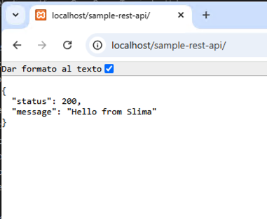
====

### Endpoint para devolver una lista de productos o filtrar productos por nombre

Ahora comenzamos a desarrollar ya realmente lo que son los endpoints de una API RESTful. Comenzamos con un endpoint que devuelve una lista de productos. Inicialmente, se devolverá la lista completa de productos. Posteriormente, se mejorará el endpoint para permitir filtrar los productos por nombre. Definimos inicialmente el endpoint que devuelve una lista de productos. El endpoint responde a las solicitudes GET en la ruta `/product` y devuelve la lista completa de productos https://gist.github.com/ualmtorres/ddaf3b386aa9f87025284d51ce1bfe39[(código del ejemplo), window=_blank]

[source,php]
----
<?php
// ...existing code...

// Ruta de ejemplo para devolver una lista de productos o filtrar productos por nombre - http://localhost/sample-rest-api/product
$app->get('/product', function (RequestInterface $request, ResponseInterface $response, array $args) {
    global $products; <1>

    // Establecer los datos de la respuesta
    $data = [
        'status' => 200,
        'result' => $products <2>
    ];

    // Devolver la respuesta utilizando la función auxiliar
    return createJsonResponse($response, $data);
});
----
<1> Se accede al array global de productos.
<2> Se establecen los datos de la respuesta con el array de productos.

La figura siguiente muestra el resultado de acceder al endpoint que devuelve una lista de productos en Postman.

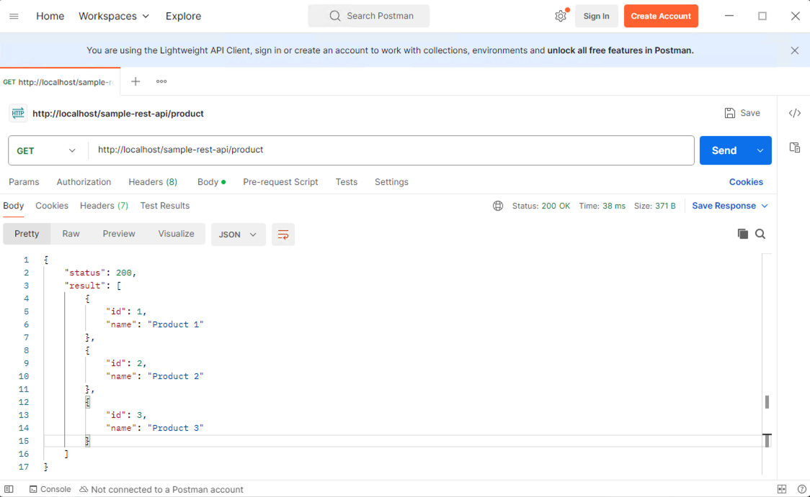

.Mejorando el endpoint para devolver una lista de productos o filtrar productos por nombre
****
En el código anterior, se devuelve la lista completa de productos. Sin embargo, sería útil poder filtrar los productos por nombre. Para ello, se puede utilizar un parámetro de consulta en la URL. Por ejemplo, para filtrar los productos por nombre, se puede utilizar la URL `http://localhost/sample-rest-api/product?name=Product 1`. En este caso, se devolverán los productos cuyo nombre coincida con "Product 1". Para implementar esta funcionalidad, se puede modificar el controlador de ruta para comprobar si se ha proporcionado un parámetro de consulta `name` y, si es así, filtrar los productos por nombre. Para capturar los parámetros de consulta en Slim, se puede utilizar el método `getQueryParams()`. Este método devuelve un array asociativo con los parámetros de consulta de la solicitud. A continuación se muestra cómo se puede hacer esto https://gist.github.com/ualmtorres/3d44a78d9df479ffd72467ee71864af1[(código del ejemplo), window=_blank].:

[source,php]
----
<?php
// ...existing code...

// Ruta de ejemplo para devolver una lista de productos o filtrar productos por nombre - http://localhost/sample-rest-api/product
$app->get('/product', function (RequestInterface $request, ResponseInterface $response, array $args) {
    global $products;

    // Obtener los parámetros de consulta
    $queryParams = $request->getQueryParams(); <1>

    // Comprobar si se proporciona un parámetro de consulta 'name'
    if (isset($queryParams['name'])) {
        // Obtener el nombre del producto
        $productName = $queryParams['name']; <2>

        // Buscar el producto por nombre
        $product = array_filter($products, function ($product) use ($productName) {
            return $product['name'] == $productName;
        });

        // Establecer los datos de la respuesta
        $data = [
            'status' => 200,
            'result' => array_shift($product)
        ];
    } else {
        // Si no se proporciona un parámetro de consulta, devolver la lista completa de productos
        // Establecer los datos de la respuesta
        $data = [
            'status' => 200,
            'result' => $products
        ];
    }

    // Devolver la respuesta utilizando la función auxiliar
    return createJsonResponse($response, $data);
});
----
<1> Los parámetros de consulta se reciben en un array asociativo. El método `getQueryParams()` se utiliza para obtener los parámetros de consulta de la solicitud.
<2> Acceso al parámetro de consulta `name`.

Ahora, el endpoint responde igualmente a las solicitudes GET en la ruta `/product`. Sin embargo, si se proporciona un parámetro de consulta `name` (p.e. `/product?name=Product 1`), filtra los productos por nombre. De lo contrario, si no se proporciona ningún parámetro de consulta (p.e. `/product`), devuelve la lista completa de productos.

La figura siguiente muestra el resultado de acceder al endpoint filtrando los productos por nombre en Postman.

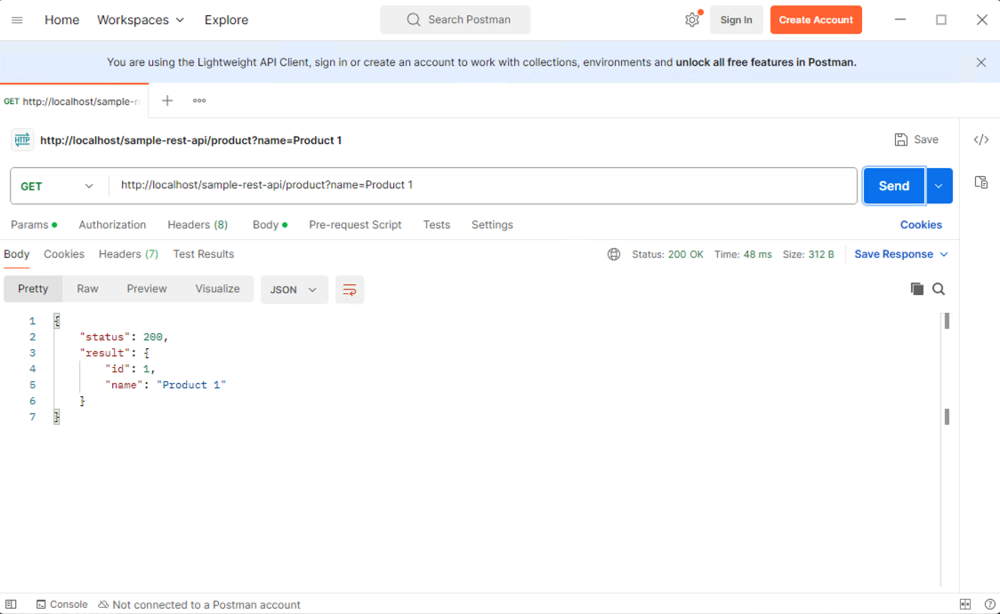
****

### Endpoint para devolver un producto específico

Continuamos con el desarrollo de la API añadiendo un endpoint que devuelve un producto específico por ID. El endpoint responde a las solicitudes GET en la ruta `/product/{id}` y devuelve el producto con el ID especificado. El ID especificado en la ruta se obtiene mediante el array `$args`, un array asociativo que contiene los parámetros de la URL. A continuación se muestra cómo se puede hacer esto https://gist.github.com/ualmtorres/8abdbc9bfc3b100a742a72ab339c6d46[(código del ejemplo), window=_blank]:

[source,php]
----
<?php
// ...existing code...

// Ruta de ejemplo para devolver un producto - http://localhost/sample-rest-api/product/1
$app->get('/product/{id}', function (RequestInterface $request, ResponseInterface $response, array $args) {
    global $products;

    // Obtener el ID del producto
    $productId = $args['id']; <1>

    // Buscar el producto por ID
    $product = array_filter($products, function ($product) use ($productId) {
        return $product['id'] == $productId;
    });

    // Establecer los datos de la respuesta
    $data = [
        'status' => 200,
        'result' => array_shift($product)
    ];

    // Devolver la respuesta utilizando la función auxiliar
    return createJsonResponse($response, $data);
});
----
<1> Se accede al parámetro de la URL `id` a través del array `$args`. La clave de acceso es `id` porque así se ha definido en la ruta `/product/{id}`.

La figura siguiente muestra el resultado de acceder al endpoint que devuelve un producto específico por ID en Postman.

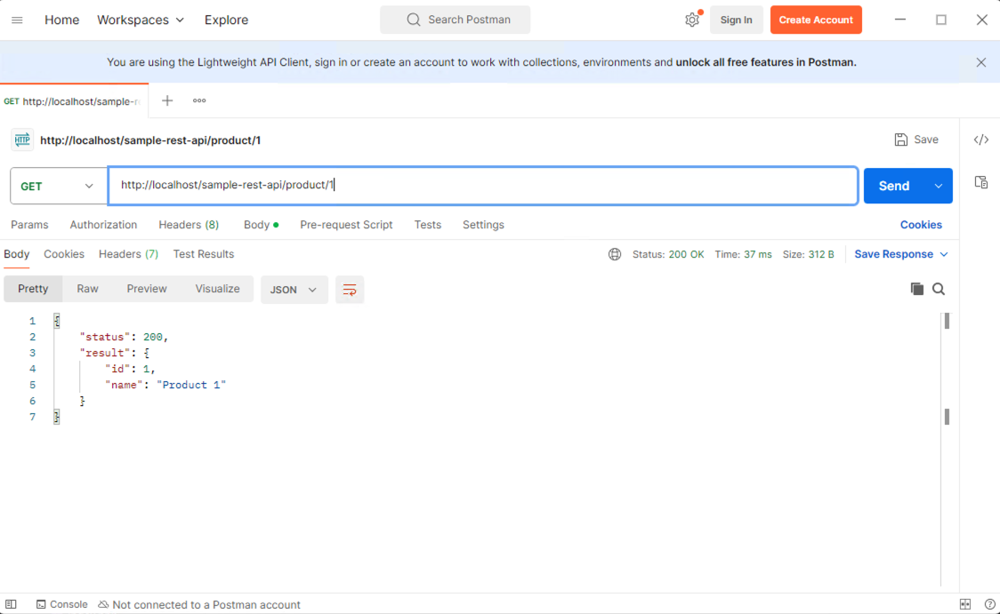

### Endpoint para crear un nuevo producto

Continuamos con el desarrollo de la API añadiendo un endpoint que crea un nuevo producto. Normalmente, la creación de recursos en una API REST se realiza mediante solicitudes POST dirigidas al endpoint raíz del recurso. En este caso, el endpoint responde a las solicitudes POST en la ruta `/product`. Además, la solicitud no incorpora un identificador en la URL, ya que el identificador se generará automáticamente por el servidor. Lo que sí lleva la solicitud son los datos del producto a crear, que se envían en el cuerpo de la solicitud. El servidor recibe la solicitud y crea un nuevo producto con los datos proporcionados en el cuerpo de la solicitud. Como respuesta, lo habitual es devolver el producto creado con un código de estado `201 Created`. (Por motivos didácticos la respuesta aquí también incluye la lista completa de productos.) A continuación se muestra cómo se puede hacer esto https://gist.github.com/ualmtorres/3e6364254c2ac578b24e97a2640bc9c3[(código del ejemplo), window=_blank]:

[source,php]
----
<?php
// ...existing code...

// Ruta de ejemplo para crear un producto - http://localhost/sample-rest-api/product
$app->post('/product', function (RequestInterface $request, ResponseInterface $response, array $args) { <1>
    global $products;

    // Obtener el cuerpo de la solicitud
    $body = $request->getParsedBody(); <2>

    // Crear un nuevo producto
    $newProduct = [
        'id' => count($products) + 1,
        'name' => $body['name'] <3>
    ];

    // Añadir el nuevo producto al array de productos
    $products[] = $newProduct;

    // Establecer los datos de la respuesta
    $data = [
        'status' => 201,
        'message' => 'Product created successfully',
        'result' => $newProduct,
        'products' => $products
    ];

    // Devolver la respuesta utilizando la función auxiliar
    return createJsonResponse($response, $data);
});
----
<1> El endpoint atiede a peticiones POST en la ruta `/product` y crea un nuevo producto con los datos proporcionados en el cuerpo de la solicitud.
<2> Se obtienen los datos del cuerpo de la solicitud utilizando el método `getParsedBody()`, que devuelve un array asociativo con los datos del cuerpo de la solicitud.
<3> Los datos del producto a crear se obtienen del cuerpo de la solicitud a través del array asociativo `$body`.

La figura siguiente muestra el resultado de acceder al endpoint que crea un nuevo producto en Postman.


### Endpoint para actualizar un producto existente

Continuamos con el desarrollo de la API añadiendo un endpoint que actualiza un producto existente. Normalmente, la actualización de recursos en una API REST se realiza mediante solicitudes PUT dirigidas a un endpoint específico del recurso indicando el ID del recurso a actualizar. En este caso, el endpoint responde a las solicitudes PUT en la ruta `/product/{id}` y actualiza el producto con el ID especificado con los datos proporcionados en el cuerpo de la solicitud. El servidor recibe la solicitud, busca el producto por ID, actualiza los datos del producto con los datos proporcionados en el cuerpo de la solicitud y devuelve el producto actualizado con un código de estado `200 OK`. (Por motivos didácticos la respuesta aquí también incluye la lista completa de productos.) A continuación se muestra cómo se puede hacer esto https://gist.github.com/ualmtorres/6cb09b98f168f6e0b26799a67266f120[(código del ejemplo), window=_blank]:

[source,php]
----
<?php
// ...existing code...

// Ruta de ejemplo para actualizar un producto - http://localhost/sample-rest-api/product/1
$app->put('/product/{id}', function (RequestInterface $request, ResponseInterface $response, array $args) { <1>
    global $products;

    // Obtener el ID del producto
    $productId = $args['id']; <2>

    // Obtener el cuerpo de la solicitud
    $body = $request->getParsedBody(); <3>

    // Buscar el producto por ID
    $product = array_filter($products, function ($product) use ($productId) {
        return $product['id'] == $productId;
    });

    // Comprobar si el producto existe
    if (empty($product)) {
        // Establecer los datos de la respuesta
        $data = [
            'status' => 204,
            'message' => 'Product not found'
        ];
    } else {
        // Actualizar el producto
        $product = array_shift($product);
        $product['name'] = $body['name']; <4>
        $products[$productId - 1] = $product;

        // Establecer los datos de la respuesta
        $data = [
            'status' => 200,
            'message' => 'Product updated successfully',
            'result' => $product,
            'products' => $products
        ];
    }

    // Devolver la respuesta utilizando la función auxiliar
    return createJsonResponse($response, $data);
});
----
<1> El endpoint atiende a peticiones PUT en la ruta `/product/{id}` y actualiza el producto con el ID especificado con los datos proporcionados en el cuerpo de la solicitud.
<2> Se accede al parámetro de la URL `id` a través del array `$args`. La clave de acceso es `id` porque así se ha definido en la ruta `/product/{id}`.
<3> Se obtienen los datos del cuerpo de la solicitud utilizando el método `getParsedBody()`, que devuelve un array asociativo con los datos del cuerpo de la solicitud.
<4> Los datos del producto a actualizar se obtienen del cuerpo de la solicitud a través del array asociativo `$body`.

La figura siguiente muestra el resultado de acceder al endpoint que actualiza un producto existente en Postman.

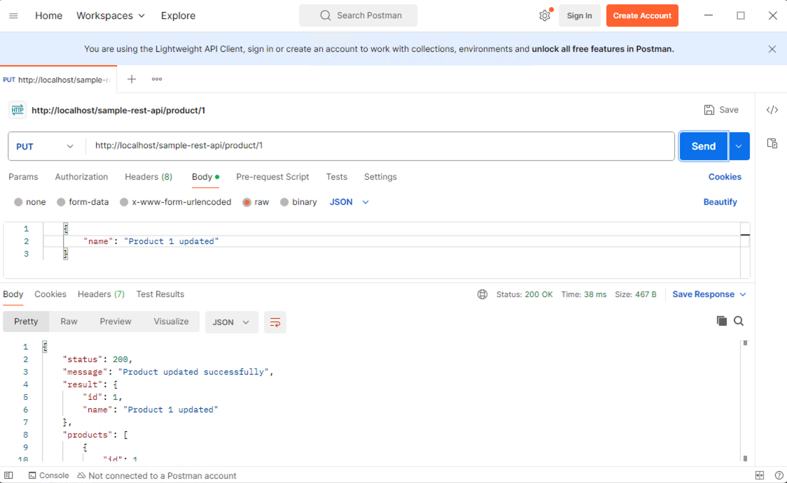

### Endpoint para eliminar un producto

Continuamos con el desarrollo de la API añadiendo un endpoint que elimina un producto. Normalmente, la eliminación de recursos en una API REST se realiza mediante solicitudes DELETE dirigidas a un endpoint específico del recurso indicando el ID del recurso a eliminar. En este caso, el endpoint responde a las solicitudes DELETE en la ruta `/product/{id}` y elimina el producto con el ID especificado. El servidor recibe la solicitud, busca el producto por ID, elimina el producto y devuelve un mensaje con un código de estado `200 OK` si el producto se ha eliminado correctamente o un código de estado `204 No Content` si el producto no se ha encontrado. (Por motivos didácticos la respuesta aquí también incluye la lista completa de productos.) A continuación se muestra cómo se puede hacer esto https://gist.github.com/ualmtorres/1d3e60773a57471470405f2ac0edfe18[(código del ejemplo), window=_blank]:

[source,php]
----
<?php
// ...existing code...

// Ruta de ejemplo para eliminar un producto - http://localhost/sample-rest-api/product/1
$app->delete('/product/{id}', function (RequestInterface $request, ResponseInterface $response, array $args) { <1>
    global $products;

    // Obtener el ID del producto
    $productId = $args['id']; <2>

    // Buscar el producto por ID
    $product = array_filter($products, function ($product) use ($productId) {
        return $product['id'] == $productId;
    });

    // Comprobar si el producto existe
    if (empty($product)) {
        // Establecer los datos de la respuesta
        $data = [
            'status' => 204,
            'message' => 'Product not found'
        ];
    } else {
        // Eliminar el producto
        $product = array_shift($product);
        unset($products[$productId - 1]);

        // Establecer los datos de la respuesta
        $data = [
            'status' => 200,
            'message' => 'Product deleted successfully',
            'result' => $product,
            'products' => $products
        ];
    }

    // Devolver la respuesta utilizando la función auxiliar
    return createJsonResponse($response, $data);
});
----
<1> El endpoint atiende a peticiones DELETE en la ruta `/product/{id}` y elimina el producto con el ID especificado.
<2> Se accede al parámetro de la URL `id` a través del array `$args`. La clave de acceso es `id` porque así se ha definido en la ruta `/product/{id}`.

La figura siguiente muestra el resultado de acceder al endpoint que elimina un producto en Postman.

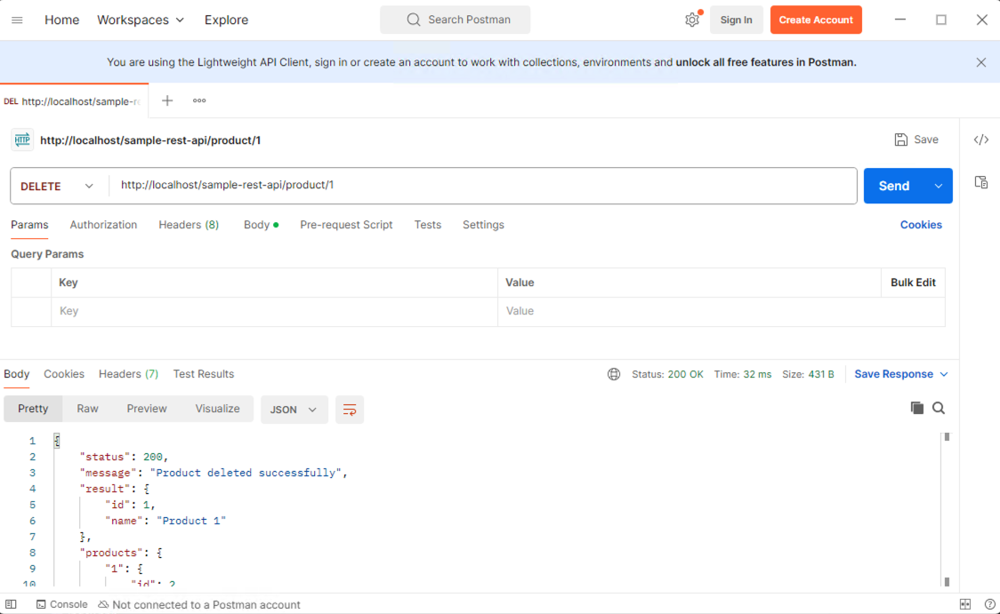

### Incerceptando peticiones a endpoints inexistentes

En Slim, se puede interceptar las peticiones a endpoints inexistentes utilizando un middleware que se ejecuta después de que se hayan procesado todas las rutas. En este caso, interceptaremos las peticiones a endpoints inexistentes y devolveremos un mensaje de error con un código de estado `404 Not Found`. A continuación se muestra cómo se puede hacer esto https://gist.github.com/ualmtorres/ba34d38de5ac72366ecb949a28b778a6[(código del ejemplo), window=_blank]:

[source,php]
----
<?php
// ...existing code...

// Interceptar todas las rutas no definidas
$app->any('{routes:.+}', function (RequestInterface $request, ResponseInterface $response) { <1>
    $data = [
        'status' => 404,
        'message' => 'Route not found'
    ];
    return createJsonResponse($response->withStatus(404), $data);
});
----
<1> El middleware intercepta todas las rutas que no se han procesado y devuelve un mensaje de error con un código de estado `404 Not Found`.

La figura siguiente muestra el resultado de acceder a un endpoint inexistente en Postman.

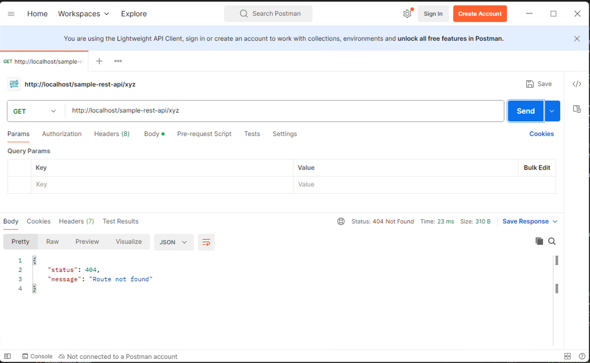

### Ejecutar la aplicación

Finalmente, ejecutamos la aplicación:

[source,php]
----
<?php
// ...existing code...

// Ejecutar la aplicación
$app->run();
----
Este comando inicia la aplicación Slim y la pone en funcionamiento.

Ahora se pueden probar los endpoints de la API en un navegador o con una herramienta como Postman. La figuras anteriores muestran el resultado de acceder a los diferentes endpoints de la API en Postman.

## Desarrollo de una API REST con Slim Framework y MySQL

Una vez que conocemos los fundamentos de una API REST y hemos desarrollado una API REST básica con Slim Framework, vamos a dar un paso más y desarrollar una API REST que interactúe con una base de datos MySQL. En este caso, utilizaremos una base de datos MySQL para almacenar y gestionar una lista de productos. A continuación se detallan los pasos a seguir para crear esta API.

### `mysqli`, una extensión de PHP para interactuar con MySQL

Para interactuar con una base de datos MySQL en PHP, utilizaremos la extensión `mysqli`. `mysqli` es una extensión de PHP que proporciona una interfaz para interactuar con bases de datos MySQL. Permite realizar operaciones CRUD (Create, Read, Update, Delete) en la base de datos y manejar errores de forma eficiente. A continuación se detallan los pasos a seguir para interactuar con una base de datos MySQL utilizando `mysqli` y se muestran los objetos y métodos más comunes para realizar operaciones en la base de datos.

[TIP]
====
Para una información más detallada sobre la clase `mysqli`, sus métodos y cómo interactuar con una base de datos MySQL, se recomienda consultar el https://ualmtorres.github.io/Tutorialmysqli/[Tutorial sobre la clase mysqli en PHP para interactuar con bases de datos MySQL].
====

1. Conexión a la base de datos: Para conectarse a una base de datos MySQL, se debe crear una instancia de la clase `mysqli` y proporcionar la información de conexión, como el nombre de host, el nombre de usuario, la contraseña y el nombre de la base de datos. La conexión queda establecida una vez que se crea la instancia de la clase `mysqli`. A continuación se muestra un ejemplo de cómo conectarse a una base de datos MySQL utilizando `mysqli`.
+
[source,php]
----
$host = 'localhost';
$dbname = 'sample_api';
$username = 'root';
$password = '';

$mysqli = new mysqli($host, $username, $password, $dbname);

if ($mysqli->connect_error) {
    die('Connection failed: ' . $mysqli->connect_error);
}
----
En este ejemplo, se crea una conexión a una base de datos MySQL llamada `sample_api` en el host `localhost` utilizando el nombre de usuario `root` y sin contraseña. Si la conexión falla, se muestra un mensaje de error.

2. Consultas a la base de datos: Una vez establecida la conexión a la base de datos, se pueden realizar consultas para recuperar, insertar, actualizar o eliminar datos. Las consultas se realizan utilizando el método `mysqli::query`.
+
[source,php]
----
$query = 'SELECT * FROM product';
$result = $mysqli->query($query);
if ($result->num_rows > 0) {
    while ($row = $result->fetch_assoc()) {
        // Procesar los datos
    }
}
----
En este ejemplo, se realiza una consulta para recuperar todos los productos de la tabla `product`. Si se encuentran productos, se procesan los datos utilizando el método `mysqli_result::fetch_assoc`. `mysql_query` permite la ejecución de consultas SQL en la base de datos. Si la consulta SQL es un `SELECT`, `mysql_query` devolverá un recurso de resultado que puede ser utilizado para recuperar los datos de la consulta. En cambio, si la consulta SQL es un `INSERT`, `UPDATE` o `DELETE`, `mysql_query` devolverá `true` o `false` dependiendo del éxito de la operación.

3. Recuperación de datos: Una vez realizada la consulta, se pueden recuperar los datos utilizando métodos como `mysqli_result::fetch_assoc`, `mysqli_result::fetch_row` o `mysqli_result::fetch_array`. Estos métodos permiten obtener los datos de la consulta en forma de array asociativo, array indexado o array combinado, respectivamente. A continuación se muestra un ejemplo de cómo recuperar los datos de una consulta utilizando `mysqli_result::fetch_assoc`.
+
[source,php]
----
while ($row = $result->fetch_assoc()) {
    echo 'ID: ' . $row['id'] . ', Name: ' . $row['name'];
}
----
En este ejemplo, se recorren los resultados de la consulta y se muestran los campos `id` y `name` de cada fila.

4. Inserción de datos: Para insertar datos en la base de datos, se puede utilizar el método `mysqli::query` con una consulta SQL de inserción. A continuación se muestra un ejemplo de cómo insertar un nuevo producto en la tabla `product`.
+
[source,php]

----
$name = 'Product 1';
$price = 10.99;

$query = "INSERT INTO product (name, price) VALUES ('$name', $price)";
if ($mysqli->query($query) === TRUE) {
    echo 'Producto insertado correctamente';
} else {
    echo 'Error al insertar el producto: ' . $mysqli->error;
}
----
En este ejemplo, se inserta un nuevo producto con el nombre `Product 1` y el precio `10.99` en la tabla `product`. Si la inserción es exitosa, se muestra un mensaje de éxito. En caso de error, se muestra un mensaje de error con la descripción del error.

5. La actualización y la eliminación de datos se realizan de forma similar a la inserción de datos. Para actualizar datos, se utiliza una consulta SQL de actualización (`UPDATE`) con el método `mysqli::query`. Para eliminar datos, se utiliza una consulta SQL de eliminación (`DELETE`) con el método `mysqli::query`.

.Soluciones al problema de la inyección de SQL
****
La inyección de SQL es un tipo de ataque en el que un atacante inserta código SQL malicioso en una consulta SQL para manipular la base de datos. Para prevenir la inyección de SQL, se deben utilizar consultas preparadas o consultas parametrizadas en lugar de concatenar valores directamente en la consulta SQL. Las consultas preparadas permiten separar los datos de la consulta SQL y evitar la inyección de SQL. A continuación se muestra un ejemplo de cómo utilizar consultas preparadas en `mysqli`.

[source,php]
----
$name = 'Product 1';
$price = 10.99;

// Crear una consulta preparada
$query = $mysqli->prepare('INSERT INTO product (name, price) VALUES (?, ?)');
$query->bind_param('sd', $name, $price);

// Ejecutar la consulta preparada
$query->execute();
----
En este ejemplo, se crea una consulta preparada con los marcadores de posición `?` para los valores `name` y `price`. Los valores se enlazan a los marcadores de posición utilizando el método `mysqli_stmt::bind_param`. Finalmente, se ejecuta la consulta preparada utilizando el método `mysqli_stmt::execute`. Esto evita la inyección de SQL y protege la base de datos de ataques maliciosos.

[NOTE]
====
En `bind_param` se especifica el tipo de datos de los valores y los valores a enlazar. Ejemplos de tipos de datos son `s` para cadenas, `i` para enteros y `d` para números de punto flotante. En el ejemplo anterior, `sd` indica que el primer valor es una cadena y el segundo valor es un número de punto flotante.
====

Por tanto, en lugar de especificar el código de la consulta SQL directamente en la llamada a `mysqli::query`, se puede utilizar una consulta preparada para evitar la inyección de SQL y garantizar la seguridad de la base de datos. En la consulta preparada, se utilizan marcadores de posición (`?`) para los valores y se enlazan los valores a los marcadores de posición utilizando el método `mysqli_stmt::bind_param`. Esto ayuda a prevenir la inyección de SQL y garantiza la seguridad de la base de datos.
****

.Sanitización de datos
****
La sanitización de datos es un proceso que se utiliza para limpiar y validar los datos antes de insertarlos en la base de datos. La sanitización de datos ayuda a prevenir errores y ataques maliciosos en la base de datos. Algunas técnicas comunes de sanitización de datos son:

* Eliminación de caracteres especiales: Se eliminan los caracteres especiales que pueden ser utilizados en ataques de inyección de SQL.
+
[source,php]
----
$name = 'Product 1';
$price = 10.99;

// Sanitizar los datos
$name = $mysqli->real_escape_string($name);
$price = (float) $price;

// Crear una consulta preparada
$query = $mysqli->prepare('INSERT INTO product (name, price) VALUES (?, ?)');
$query->bind_param('sd', $name, $price);

// Ejecutar la consulta preparada
$query->execute();
----
En este ejemplo, se utiliza el método `mysqli::real_escape_string` para eliminar los caracteres especiales del nombre del producto y se convierte el precio a un número de punto flotante utilizando `(float)`. Esto ayuda a prevenir la inyección de SQL y garantiza que los datos sean válidos antes de insertarlos en la base de datos.

* Validación de datos: Se validan los datos para asegurarse de que cumplen con ciertos criterios (p.e. longitud, formato).
+
[source,php]
----
$name = 'Product 1';
$price = 10.99;

// Validar los datos
if (strlen($name) > 0 && is_numeric($price)) {
    // Crear una consulta preparada
    $query = $mysqli->prepare('INSERT INTO product (name, price) VALUES (?, ?)');
    $query->bind_param('sd', $name, $price);

    // Ejecutar la consulta preparada
    $query->execute();
} else {
    echo 'Datos no válidos';
}
----
En este ejemplo, se valida que el nombre del producto tenga una longitud mayor que cero y que el precio sea un número. Si los datos no son válidos, se muestra un mensaje de error. Esto ayuda a garantizar que los datos sean válidos antes de insertarlos en la base de datos.

* Filtrado de datos: Se filtran los datos para eliminar caracteres no deseados o no válidos.
+
[source,php]
----
$name = 'Product 1';
$price = 10.99;

// Filtrar los datos
$name = filter_var($name, FILTER_SANITIZE_STRING);
$price = filter_var($price, FILTER_SANITIZE_NUMBER_FLOAT);

// Crear una consulta preparada
$query = $mysqli->prepare('INSERT INTO product (name, price) VALUES (?, ?)');
$query->bind_param('sd', $name, $price);

// Ejecutar la consulta preparada
$query->execute();
----
En este ejemplo, se utiliza la función `filter_var` con los filtros `FILTER_SANITIZE_STRING` y `FILTER_SANITIZE_NUMBER_FLOAT` para filtrar el nombre del producto y el precio. Esto ayuda a eliminar caracteres no deseados y garantizar que los datos sean válidos antes de insertarlos en la base de datos.

La sanitización de datos es una práctica recomendada para garantizar la integridad y seguridad de la base de datos.
****

### Configuración de la base de datos

Una vez que conocemos los principales objetos y métodos de la extensión `mysqli` para interactuar con una base de datos MySQL, y cómo evitar la inyección de SQL, vamos a configurar la base de datos para la API REST con Slim y MySQL. A continuación se detallan los pasos a seguir para configurar la base de datos https://gist.github.com/ualmtorres/ba60af010401b447453f68bab9c54958[(sample_api.sql), window=_blank]:

1. Crear una base de datos MySQL llamada `sample_api`.
+
[source,sql]
----
CREATE DATABASE IF NOT EXISTS sample_api;
----
2. Crear una tabla `product` en la base de datos `sample_api` con los siguientes campos:
   * `id`: Identificador único del producto (clave primaria).
   * `name`: Nombre del producto.
   * `price`: Precio del producto.
   * `created_at`: Fecha de creación del producto.
   * `updated_at`: Fecha de actualización del producto.
+
[source,sql]
----
CREATE TABLE IF NOT EXISTS product (
    id INT AUTO_INCREMENT PRIMARY KEY,
    name VARCHAR(255) NOT NULL,
    price DECIMAL(10, 2) NOT NULL,
    created_at TIMESTAMP DEFAULT CURRENT_TIMESTAMP,
    updated_at TIMESTAMP DEFAULT CURRENT_TIMESTAMP ON UPDATE CURRENT_TIMESTAMP
);
----
3. Añadir algunos productos a la tabla `product` para probar la API.
+
[source,sql]
----
INSERT INTO product (name, price) VALUES ('Product 1', 10.99);
INSERT INTO product (name, price) VALUES ('Product 2', 20.99);
INSERT INTO product (name, price) VALUES ('Product 3', 30.99);
----

### Creación de una API REST con Slim y MySQL

A continuación se detallan los pasos a seguir para crear una API REST con Slim y MySQL:

1. Crear un archivo https://gist.github.com/ualmtorres/a9fb6a4c5eeb7630f3b23346802359f5[`config.php`] en la carpeta raíz del proyecto (`sample-rest-api`) con la configuración de la base de datos:
    * `host`: Nombre del host de la base de datos.
    * `username`: Nombre de usuario de la base de datos.
    * `password`: Contraseña de la base de datos.
    * `database`: Nombre de la base de datos.
+
[source,php]
----
<?php

$config = [
    'host' => 'localhost',
    'username' => 'root',
    'password' => '',
    'database' => 'sample_api'
];

return $config;
----
2. Crear un archivo https://gist.github.com/ualmtorres/9353103660b8f9dc74a6c16445a5ffc2[`db.php`] en la carpeta raíz del proyecto (`sample-rest-api`) que establezca la conexión a la base de datos MySQL y devuelva la conexión:
+
[source,php]
----
<?php

require 'config.php'; <1>

// Configuración de la base de datos
$host = $config['host'];
$username = $config['username'];
$password = $config['password'];
$database = $config['database'];

// Conexión a la base de datos
$mysqli = new mysqli($host, $username, $password, $database); <2>

// Comprobar la conexión
if ($mysqli->connect_error) {
    die('Error de conexión: ' . $mysqli->connect_error);
}

return $mysqli;
----
<1> Importar la configuración de la base de datos del archivo `config.php`.
<2> Establecer la conexión a la base de datos MySQL y devolver la conexión para que pueda ser utilizada en otros archivos.

En este archivo, se importa la configuración de la base de datos del archivo `config.php`, se establece la conexión a la base de datos MySQL y se devuelve la conexión para que pueda ser utilizada en otros archivos.

3. Crear un archivo https://gist.github.com/ualmtorres/cf74c3a24cd5122e0c8528198f93bc56[`index.php`] en la carpeta `public` con la API REST que interactúa con la base de datos:
+
[TIP]
====
Si ya existe un archivo `index.php` en la carpeta `public` de ejemplos anteriores, los renombraremos para dejar libre el nombre de archivo `index.php` para el archivo principal de la API REST con MySQL. La configuración definida en los archivos `.htaccess` dirige todo el tráfico a un archivo `index.php` en la carpeta `public`, por lo que es importante que el archivo principal de la API tenga este nombre.
====
+
[source,php]
----
<?php

require dirname(__DIR__) . '/vendor/autoload.php';
require dirname(__DIR__) . '/db.php'; <1>


use Psr\Http\Message\RequestInterface;
use Psr\Http\Message\ResponseInterface;
use Slim\Factory\AppFactory;

// Crear la aplicación
$app = AppFactory::create();

// Configurar la ruta base
$app->setBasePath('/sample-rest-api'); <2>

// Configurar Slim para procesar datos JSON
$app->addBodyParsingMiddleware(); <3>

// Helper function to handle the response 
function createJsonResponse(ResponseInterface $response, array $data): ResponseInterface { <4>
    // Set the response content type
    $response = $response->withHeader('Content-Type', 'application/json; charset=utf-8');

    // Write the response
    $response->getBody()->write(json_encode($data));

    // Return the response
    return $response;
}

$host = 'localhost';
$dbname = 'sample_api';
$username = 'root';
$password = '';

$mysqli = new mysqli($host, $username, $password, $dbname); <5>

if ($mysqli->connect_error) {
    die('Connection failed: ' . $mysqli->connect_error);
}

// Ruta para obtener todos los productos
$app->get('/product', function (RequestInterface $request, ResponseInterface $response, array $args) { <6>
    global $mysqli;

    // Consulta para obtener todos los productos
    $query = 'SELECT * FROM product';
    $stmt = $mysqli->prepare($query);
    $stmt->execute();
    $result = $stmt->get_result();

    // Comprobar si hay productos
    if ($result->num_rows > 0) {
        $products = [];
        while ($row = $result->fetch_assoc()) {
            $products[] = $row;
        }

        // Establecer los datos de la respuesta
        $data = [
            'status' => 200,
            'result' => $products
        ];
    } else {
        // Establecer los datos de la respuesta
        $data = [
            'status' => 204,
            'message' => 'No products found'
        ];
    }

    // Devolver la respuesta utilizando la función auxiliar
    return createJsonResponse($response, $data);
});

// Ruta para obtener un producto por ID
$app->get('/product/{id}', function (RequestInterface $request, ResponseInterface $response, array $args) {
    global $mysqli;

    // Obtener el ID del producto
    $productId = $args['id']; <7>

    // Consulta para obtener un producto por ID
    $query = "SELECT * FROM product WHERE id = ?"; <8>
    $stmt = $mysqli->prepare($query); <9>
    $stmt->bind_param('i', $productId); <10>
    $stmt->execute(); <11>
    $result = $stmt->get_result(); <12>

    // Comprobar si hay un producto
    if ($result->num_rows > 0) {
        $product = $result->fetch_assoc(); <13>

        // Establecer los datos de la respuesta
        $data = [
            'status' => 200,
            'result' => $product
        ];
    } else {
        // Establecer los datos de la respuesta
        $data = [
            'status' => 204,
            'message' => 'Product not found'
        ];
    }

    // Devolver la respuesta utilizando la función auxiliar
    return createJsonResponse($response, $data);
});

// Ruta para crear un nuevo producto
$app->post('/product', function (RequestInterface $request, ResponseInterface $response, array $args) { <14>
    global $mysqli;

    // Obtener el cuerpo de la solicitud
    $body = $request->getParsedBody(); <15>

    // Crear un nuevo producto
    $name = $body['name']; <16>
    $price = $body['price'];
    $createdAt = date('Y-m-d H:i:s');
    $updatedAt = date('Y-m-d H:i:s');

    // Consulta para crear un nuevo producto
    $query = "INSERT INTO product (name, price, created_at, updated_at) VALUES (?, ?, ?, ?)"; <17>
    $stmt = $mysqli->prepare($query); <18>
    $stmt->bind_param('sdss', $name, $price, $createdAt, $updatedAt); <19>
    $result = $stmt->execute(); <20>

    // Comprobar si se ha creado el producto
    if ($result) {
        // Obtener el ID del producto creado
        $productId = $mysqli->insert_id;

        // Consulta para obtener el producto creado
        $query = "SELECT * FROM product WHERE id = ?";
        $stmt = $mysqli->prepare($query);
        $stmt->bind_param('i', $productId);
        $stmt->execute();
        $result = $stmt->get_result();

        // Comprobar si se ha obtenido el producto
        if ($result->num_rows > 0) {
            $product = $result->fetch_assoc();

            // Establecer los datos de la respuesta
            $data = [
                'status' => 201,
                'message' => 'Product created successfully',
                'result' => $product
            ];
        } else {
            // Establecer los datos de la respuesta
            $data = [
                'status' => 204,
                'message' => 'Product not found'
            ];
        }
    } else {
        // Establecer los datos de la respuesta
        $data = [
            'status' => 400,
            'message' => 'Error creating product'
        ];
    }

    // Devolver la respuesta utilizando la función auxiliar
    return createJsonResponse($response, $data);
});

// Ruta para actualizar un producto
$app->put('/product/{id}', function (RequestInterface $request, ResponseInterface $response, array $args) { <21>
    global $mysqli;

    // Obtener el ID del producto
    $productId = $args['id'];

    // Obtener el cuerpo de la solicitud
    $body = $request->getParsedBody();

    // Comprobar si el producto existe
    $query = "SELECT * FROM product WHERE id = ?"; <22>
    $stmt = $mysqli->prepare($query); <23>
    $stmt->bind_param('i', $productId); <24>
    $stmt->execute(); <25>
    $result = $stmt->get_result();

    if ($result->num_rows > 0) {
        // Actualizar el producto

        // Asignar $name y $price si existen, de lo contrario asignar NULL
        $name = isset($body['name']) ? $body['name'] : NULL; 
        $price = isset($body['price']) ? $body['price'] : NULL; 

        $updatedAt = date('Y-m-d H:i:s');

        // Update the product. COALESCE is used to keep the existing value if the new value is NULL  
        $query = "UPDATE product SET name = COALESCE(?, name), price = COALESCE(?, price), updated_at = ? WHERE id = ?"; <26>
        $stmt = $mysqli->prepare($query);
        $stmt->bind_param('sdsi', $name, $price, $updatedAt, $productId);
        $result = $stmt->execute(); <27>

        // Comprobar si se ha actualizado el producto
        if ($result) {
            // Consulta para obtener el producto actualizado
            $query = "SELECT * FROM product WHERE id = ?";
            $stmt = $mysqli->prepare($query);
            $stmt->bind_param('i', $productId);
            $stmt->execute();
            $result = $stmt->get_result();

            // Comprobar si se ha obtenido el producto
            if ($result->num_rows > 0) {
                $product = $result->fetch_assoc();

                // Establecer los datos de la respuesta
                $data = [
                    'status' => 200,
                    'message' => 'Product updated successfully',
                    'result' => $product
                ];
            } else {
                // Establecer los datos de la respuesta
                $data = [
                    'status' => 204,
                    'message' => 'Product not found'
                ];
            }
        } else {
            // Establecer los datos de la respuesta
            $data = [
                'status' => 400,
                'message' => 'Error updating product'
            ];
        }
    } else {
        // Establecer los datos de la respuesta
        $data = [
            'status' => 204,
            'message' => 'Product not found'
        ];
    }

    // Devolver la respuesta utilizando la función auxiliar
    return createJsonResponse($response, $data);
});

// Ruta para eliminar un producto
$app->delete('/product/{id}', function (RequestInterface $request, ResponseInterface $response, array $args) { <28>
    global $mysqli;

    // Obtener el ID del producto
    $productId = $args['id'];

    // Comprobar si el producto existe
    $query = "SELECT * FROM product WHERE id = ?"; <29>
    $stmt = $mysqli->prepare($query); <30>
    $stmt->bind_param('i', $productId); <31>
    $stmt->execute(); <32>
    $result = $stmt->get_result();

    if ($result->num_rows > 0) {
        // Eliminar el producto
        $query = "DELETE FROM product WHERE id = ?"; <33>
        $stmt = $mysqli->prepare($query);
        $stmt->bind_param('i', $productId);
        $result = $stmt->execute(); <34>

        // Comprobar si se ha eliminado el producto
        if ($result) {
            // Establecer los datos de la respuesta
            $data = [
                'status' => 200,
                'message' => 'Product deleted successfully'
            ];
        } else {
            // Establecer los datos de la respuesta
            $data = [
                'status' => 400,
                'message' => 'Error deleting product'
            ];
        }
    } else {
        // Establecer los datos de la respuesta
        $data = [
            'status' => 204,
            'message' => 'Product not found'
        ];
    }

    // Devolver la respuesta utilizando la función auxiliar
    return createJsonResponse($response, $data);
});

// Interceptar todas las rutas no definidas 
$app->any('{routes:.+}', function (RequestInterface $request, ResponseInterface $response) { <35>
    $data = [
        'status' => 404,
        'message' => 'Route not found'
    ];
    return createJsonResponse($response->withStatus(404), $data);
});

// Ejecutar la aplicación
$app->run();
----
<1> Importar la conexión a la base de datos del archivo `db.php`.
<2> Establecer la ruta base de la API.
<3> Configurar Slim para procesar datos JSON.
<4> Función auxiliar para manejar la respuesta de la API.
<5> Establecer la conexión a la base de datos MySQL.
<6> Endpoint para obtener todos los productos.
<7> Acceder al parámetro de la URL `id`.
<8> Consulta para obtener un producto por ID.
<9> Preparar la consulta para obtener un producto por ID.
<10> Enlazar el ID del producto a la consulta.
<11> Ejecutar la consulta.
<12> Obtener el resultado de la consulta.
<13> Obtener el producto por ID.
<14> Endpoint para crear un nuevo producto.
<15> Obtener los datos del cuerpo de la solicitud.
<16> Obtener el nombre y el precio del producto.
<17> Consulta para crear un nuevo producto.
<18> Preparar la consulta para crear un nuevo producto.
<19> Enlazar los valores a la consulta.
<20> Ejecutar la consulta para crear un nuevo producto.
<21> Endpoint para actualizar un producto.
<22> Consulta para comprobar si el producto existe.
<23> Preparar la consulta para comprobar si el producto existe.
<24> Enlazar el ID del producto a la consulta.
<25> Ejecutar la consulta.
<26> Consulta para actualizar un producto.
<27> Ejecutar la consulta para actualizar un producto.
<28> Endpoint para eliminar un producto.
<29> Consulta para comprobar si el producto existe.
<30> Preparar la consulta para comprobar si el producto existe.
<31> Enlazar el ID del producto a la consulta.
<32> Ejecutar la consulta.
<33> Consulta para eliminar un producto.
<34> Ejecutar la consulta para eliminar un producto.
<35> Middleware para interceptar rutas no definidas.

En este archivo, se importa la conexión a la base de datos del archivo `db.php`, se definen los endpoints para obtener todos los productos, obtener un producto por ID, crear un nuevo producto, actualizar un producto existente y eliminar un producto. Se utilizan consultas preparadas para interactuar con la base de datos y se manejan los casos en los que no se encuentran productos o se producen errores. Además, se interceptan las rutas no definidas para devolver un mensaje de error con un código de estado `404 Not Found`.

### Pruebas de la API REST

Una vez que hemos desarrollado la API REST con Slim Framework, podemos probar los endpoints utilizando Postman. A continuación se detallan los pasos a seguir para probar la API REST:

1. Iniciar el servidor Apache y MySQL.
2. Abrir Postman.
3. En Postman, enviar solicitudes a los endpoints de la API REST para probar las operaciones CRUD en la lista de productos.

A continuación se muestran algunos ejemplos de peticiones a la API REST:

* `GET /product`: Obtener la lista de todos los productos.
+
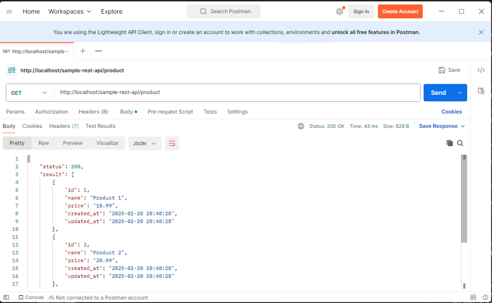
* `GET /product/1`: Obtiene el producto con ID 1.
+
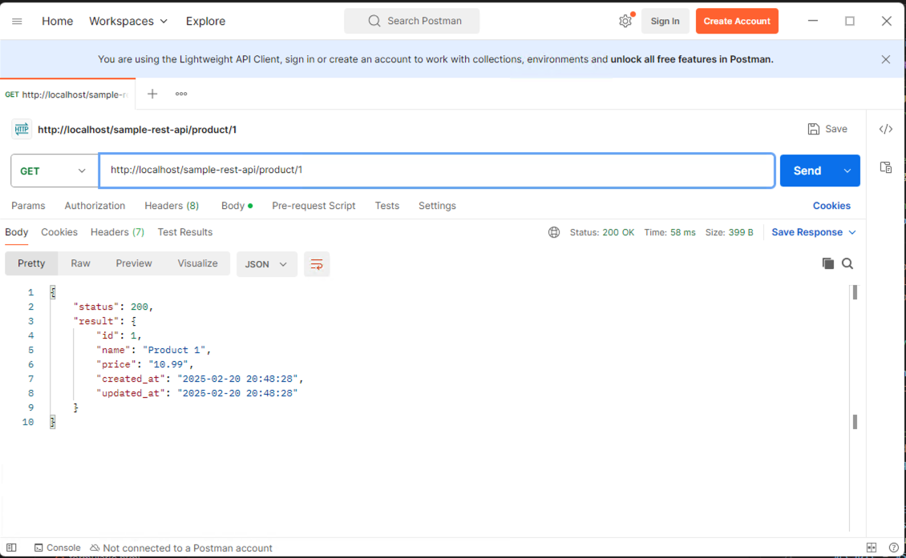
* `POST /product`: Crea un nuevo producto añadiendo los datos siguientes en el cuerpo de la solicitud.
+
[source,json]
----
{
    "name": "Product 4",
    "price": 40.99
}
----
+
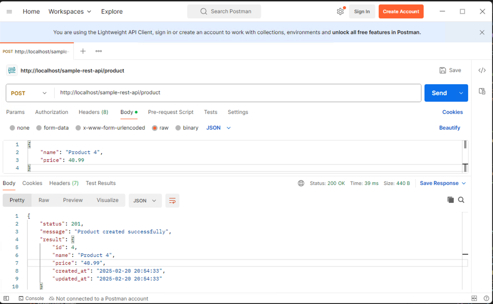
* `PUT /product/1`: Actualiza el producto con ID 1 añadiendo los datos siguientes en el cuerpo de la solicitud.
+
[source,json]
----
{
    "name": "Product 1 Updated"
}
----
+
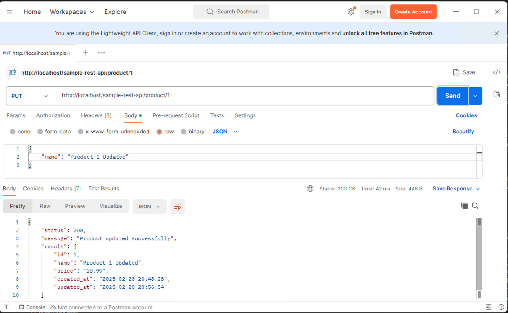
* `DELETE /product/4`: Elimina el producto con ID 4.
+
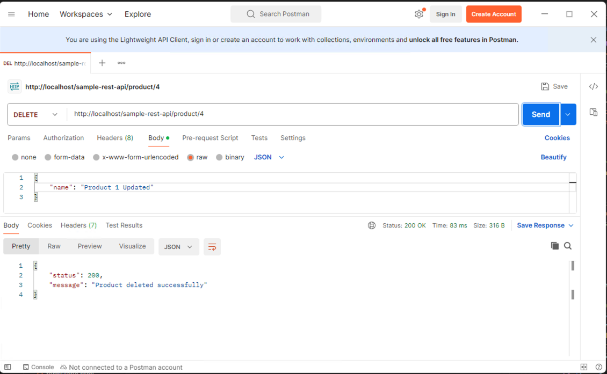

En estos ejemplos, se han probado las operaciones CRUD en la lista de productos utilizando la API REST con Slim y MySQL. Se han obtenido todos los productos, se ha obtenido un producto por ID, se ha creado un nuevo producto, se ha actualizado un producto existente y se ha eliminado un producto. Las operaciones CRUD se han realizado con éxito y se han devuelto los resultados esperados.

## Resumen

Una API REST proporciona una interfaz para interactuar con una base de datos usando el protocolo HTTP. Este enfoque permite a los clientes acceder y manipular los datos de la base de datos de forma remota y de forma totalmente agnóstica a la tecnología subyacente. 

En este tutorial, hemos aprendido a desarrollar una API REST con Slim Framework utilizando PHP. Slim Framework es un microframework PHP que permite crear aplicaciones web y APIs de forma rápida y sencilla. Hemos creado una API REST básica con Slim Framework y luego hemos dado un paso más para desarrollar una API REST que interactúe con una base de datos MySQL. Hemos utilizado la extensión `mysqli` de PHP para interactuar con la base de datos MySQL y hemos configurado la base de datos para almacenar y gestionar una lista de productos. Hemos desarrollado una API REST con Slim y MySQL que permite realizar operaciones CRUD en la lista de productos, como obtener todos los productos, obtener un producto por ID, crear un nuevo producto, actualizar un producto existente y eliminar un producto. Además, hemos realizado sentencias preparadas para evitar la inyección de SQL para garantizar la seguridad de la base de datos. Finalmente, hemos probado la API REST utilizando una herramienta como Postman para verificar que funcione correctamente.

:numbered!: 

## Licencia

Licencia CC BY-NC-ND 4.0

Copyright (c) 2025 [Manuel Torres - Departamento de Informática - Universidad de Almería]

Este proyecto está licenciado bajo la Licencia CC BY-NC-ND 4.0. Esto significa que puedes compartir el proyecto siempre que cites al autor, no lo uses para fines comerciales y no realices obras derivadas.